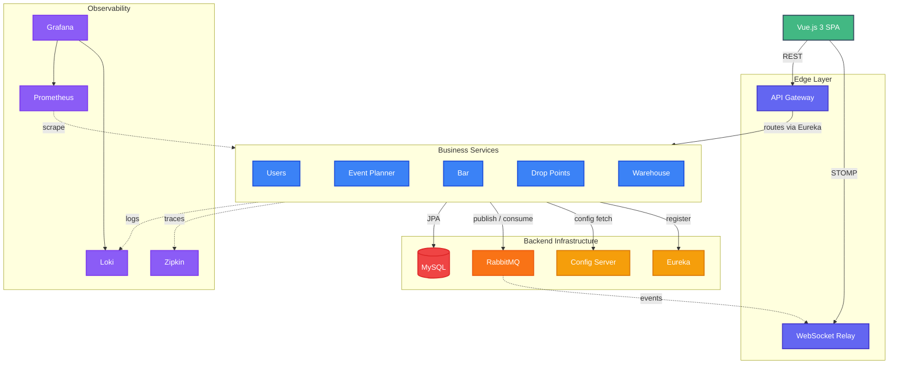

<h1 align="center">NextBar</h1>

<p align="center">
  <strong>Event Beverage Management System</strong><br>
  <em>A microservices platform for managing bars, beverages, and bottle recycling at large-scale events</em>
</p>

<p align="center">
  
  
  
  
  
  
  
  
</p>

---

## Overview

NextBar is a distributed system designed to streamline beverage management at large-scale events like festivals and concerts. It provides real-time inventory tracking, automated supply chain management, and efficient bottle recycling workflows — all backed by an event-driven microservices architecture with full observability.


### Key Features

- **Bar Management** — Track stock levels per bar, serve drinks with usage logging, and auto-request resupply from the warehouse when stock runs low
- **Central Warehouse** — Manage beverage inventory, process supply requests from bars, and handle empty bottle storage from drop-point collections
- **Bottle Drop Points** — Monitor bottle return stations with capacity tracking, fullness alerts, and coordinated warehouse collection
- **Event Planning** — Orchestrate events end-to-end: create events, attach bars and drop points, plan initial stock, assign staff, and publish to kick off operations
- **User Management** — Role-based access control with JWT authentication, refresh token rotation, token blacklisting, and brute-force login protection
- **Real-Time Updates** — WebSocket push notifications keep every connected dashboard in sync instantly via RabbitMQ → Gateway relay
- **Full Observability** — Distributed tracing (Zipkin), metrics (Prometheus), log aggregation (Loki), and pre-provisioned Grafana dashboards
- **Docker Ready** — Full 15-container stack with a single `docker compose up`
- **CI/CD Pipeline** — GitHub Actions with Maven verify, Docker build, Trivy security scanning, and Azure deployment

> **Want to run it?** See the [Quick Start Guide](QUICK-START.md) for step-by-step setup instructions.
>
> **Want to dive into the architecture?** This repository includes a comprehensive set of documentation detailing our Domain-Driven Design approach, diagrams, and implementation patterns. See the [Documentation](#documentation) section below for the full list, or check out the [Architecture Diagrams](docs/architecture_diagram.md) to get started.

---

## Architecture



> For the detailed component diagram, see [`docs/architecture_diagram.md`](docs/architecture_diagram.md).

---

## Tech Stack

| Layer | Technology |
|-------|------------|
| **Language** | Java 21, TypeScript |
| **Backend** | Spring Boot 3.2.5, Spring Cloud 2023.0.1 |
| **Build** | Maven multi-module (centralized BOM with JaCoCo coverage) |
| **Service Discovery** | Netflix Eureka |
| **Configuration** | Spring Cloud Config (Git-backed — fetches from GitHub repository) |
| **API Gateway** | Spring Cloud Gateway (WebFlux) |
| **Sync Communication** | OpenFeign + Resilience4j circuit breakers (Event Planner only) |
| **Async Communication** | RabbitMQ via Spring Cloud Stream |
| **Database** | MySQL 8.0 (all services, auto-provisioned via `init-databases.sql`) |
| **Security** | JWT (access + refresh), rate limiting, RBAC, security headers |
| **API Documentation** | SpringDoc OpenAPI 2.5 (Swagger UI per service) |
| **Frontend** | Vue 3 (Composition API), Pinia, TanStack Vue Query, Vue Router, Axios |
| **Styling** | Tailwind CSS 3 |
| **Real-Time** | WebSocket (ticket-based auth via gateway RabbitMQ relay) |
| **Tracing** | Zipkin + Micrometer Brave |
| **Metrics** | Prometheus + Micrometer |
| **Log Aggregation** | Loki + Loki4j Logback appender |
| **Dashboards** | Grafana (pre-provisioned datasources + NextBar dashboard) |
| **Containerization** | Docker + Docker Compose (15 containers) |
| **CI/CD** | GitHub Actions → Azure Container Registry → Azure Container Apps |
| **Security Scanning** | CodeQL SAST, Trivy (container images), OWASP Dependency-Check |
| **Testing** | JUnit 5, Mockito, JaCoCo, Vitest, Cypress |

---

## Microservices

### Users Service — Port 8090

The identity and access management backbone. Handles user registration, JWT-based login with refresh token rotation via HTTP-only cookies, token blacklisting, brute-force login protection (exponential back-off), WebSocket ticket generation, and role/permission management. Automatically provisions a default system administrator (`admin`) and service schemas on first startup via `DataBootstrap`.

| | Details |
|---|---|
| **Package** | `com.nextbar.usersservice` |
| **Database** | `user_db` (MySQL) |
| **Controllers** | `AuthController` · `UserController` · `ProfileController` · `RoleManagmentController` |
| **Models** | `User` · `Role` · `Permission` · `Service` · `UserRoleAssignment` · `RefreshToken` · `TokenBlacklistEntry` |
| **Security** | `JwtAuthenticationFilter` · `RbacClaims` · `RbacService` · `LoginAttemptService` · `TokenLifecycleService` |
| **RabbitMQ** | Consumes `event.staff.resource.sync` (staff sync from Event Planner) |

---

### Bar Service — Port 8081

Manages runtime bar operations once an event goes live. Tracks per-bar beverage stock in real time, logs every drink served (with timestamps), handles supply replenishment requests, and receives delivery status updates — **entirely through RabbitMQ messaging, with no synchronous Feign calls**.

| | Details |
|---|---|
| **Package** | `com.nextbar.bar` |
| **Database** | `bar_db` (MySQL) |
| **Controllers** | `BarController` · `BarStockController` · `SupplyRequestController` · `UsageLogController` |
| **Models** | `Bar` · `BarStockItem` · `SupplyRequest` · `SupplyItem` · `SupplyStatus` · `UsageLog` · `EventBarAssociation` |
| **DTOs** | Request: `CreateLocalBarRequest` · `CreateSupplyRequestDto` · `StockOperationDto` — Response: `BarDto` · `BarStockItemDto` · `SupplyRequestDto` · `UsageLogDto` · `TotalServedDto` |
| **Mappers** | `BarMapper` · `BarStockMapper` · `SupplyRequestMapper` · `UsageLogMapper` |
| **RabbitMQ In** | `event.bar.created` · `event.bar.bootstrap` · `supply.request.updated` · `event.completed` |
| **RabbitMQ Out** | `supply.request.created` |

---

### Event Planner Service — Port 8082

The upstream orchestrator — everything starts here. Provides full CRUD for events with lifecycle management (Draft → Planned → Active → Completed/Cancelled). Configures bars and drop points per event, assigns staff, defines initial stock plans validated against warehouse availability, and publishes domain events that spin up the entire operational pipeline.

**The only service that uses OpenFeign** for synchronous calls to Users Service and Warehouse Service (both with Resilience4j circuit breaker fallbacks).

| | Details |
|---|---|
| **Package** | `com.nextbar.eventPlanner` |
| **Database** | `event_db` (MySQL) |
| **Controllers** | `EventController` · `BarController` · `BarStockController` · `DropPointController` |
| **Models** | `Event` · `EventStatus` · `Bar` · `BarStock` · `DropPoint` · `AssignedStaff` · `ResourceMode` |
| **Feign Clients** | `UserServiceClient` (+ `UserServiceClientFallback`) · `WarehouseServiceClient` (+ `WarehouseServiceClientFallback`) |
| **Circuit Breakers** | `userService` · `warehouseService` (Resilience4j, window=10, threshold=50%) |
| **RabbitMQ Out** | `event.bar.created` · `event.bar.bootstrap` · `event.droppoint.created` · `event.drop-point.bootstrap` · `event.staff.assigned` · `event.started` · `event.completed` · `stock.reserved.consumed` · `event.staff.resource.sync` |

---

### Drop Points Service — Port 8083

Handles the bottle-return recycling lifecycle. Tracks capacity and fill level for each drop point, accepts returned bottles (preventing returns when full), publishes collection events to the warehouse, and receives collection status updates.

| | Details |
|---|---|
| **Package** | `com.nextbar.dropPoint` |
| **Database** | `drop_points_db` (MySQL) |
| **Controllers** | `DropPointController` · `DropPointEmptiesController` · `DropPointStatusController` · `DropPointWarehouseController` |
| **Models** | `DropPoint` · `DropPointStatus` (EMPTY / FULL / FULL_AND_NOTIFIED_TO_WAREHOUSE) · `EventDroppointAssociation` |
| **Security** | `JwtAuthenticationFilter` · `InternalRequestVerificationFilter` · `RbacService` |
| **RabbitMQ In** | `event.drop-point.bootstrap` · `event.droppoint.created` · `drop-point.collection.lifecycle` · `event.completed` |
| **RabbitMQ Out** | `drop-point.collection.events` |

---

### Warehouse Service — Port 8085

The central supply hub. Manages beverage stock, processes incoming supply requests from bars (accept/fulfill/reject), and handles drop-point empty bottle collections — **entirely through RabbitMQ messaging, with no synchronous Feign calls**.

| | Details |
|---|---|
| **Package** | `com.nextbar.warehouse` |
| **Database** | `warehouse_db` (MySQL) |
| **Controllers** | `StockController` · `SupplyController` · `CollectionController` |
| **Models** | `BeverageStock` · `SupplyRequest` · `SupplyRequestItem` · `DropPointCollection` · `EmptyBottleInventory` |
| **Enums** | `SupplyRequestStatus` · `CollectionStatus` |
| **Services** | `StockService` · `SupplyRequestProcessingService` · `EmptyBottleCollectionService` |
| **Circuit Breakers** | `barService` · `dropPointService` (Resilience4j) |
| **RabbitMQ In** | `supply.request.created` · `drop-point.collection.events` |
| **RabbitMQ Out** | `supply.request.updated` · `drop-point.collection.lifecycle` |

---

## Infrastructure Services

### Config Server — Port 8888

Spring Cloud Config Server backed by a **Git repository** (default profile: `git`). On startup, the Config Server clones the NextBar GitHub repository and serves YAML configurations from the `config-repo/` directory within the repo. A `native` profile fallback is available for local development.

**Git source:** `https://github.com/m-ali-moradi/nextBar` (branch: `main`, search-path: `config-repo`)

**Managed config files:** `bar-service.yml` · `droppoint-service.yml` · `eventplanner-service.yml` · `warehouse-service.yml` · `users-service.yml` · `gateway.yml` · `prometheus.yml`

### Eureka Server — Port 8761

Netflix Eureka service registry. All services register on startup, enabling the Gateway to use `lb://` load-balanced routing.

**Dashboard:** [http://localhost:8761](http://localhost:8761)

### API Gateway — Port 8080

Spring Cloud Gateway (WebFlux) acting as the single entry point for all client traffic.

| Component | Purpose |
|-----------|---------|
| `JwtAuthenticationGatewayFilterFactory` | Validates JWT on every protected route |
| `JwtAuthenticationFilter` | Low-level JWT parsing and claims extraction |
| `LoginRateLimiter` | Brute-force protection (10 req/60s window, 300s block) |
| `SecurityHeadersWebFilter` | Injects CSP, HSTS, Referrer-Policy, Permissions-Policy |
| `TokenStatusClient` | Calls Users Service to verify token validity/blacklist status |
| `EventWebSocketHandler` | Relays RabbitMQ domain events to browsers via WebSocket |
| `RabbitEventListener` | Bridges RabbitMQ messages into the WebSocket handler |
| `WebSocketConfig` | Configures the `/ws/events` WebSocket endpoint |

---

## Frontend

A **Vue 3 SPA** located in `servers/frontend/`, built with Vite, styled with Tailwind CSS, served via Nginx in production.

### Pages

| Route | Component | Purpose |
|-------|-----------|---------|
| `/login` | `LoginPage` | Authentication |
| `/bars` | `BarsDashboard` | All assigned bars overview |
| `/bars/:barId` | `BarDetailsView` | Stock, sales, supply for one bar |
| `/droppoints` | `DroppointsView` | Drop point monitoring |
| `/warehouse` | `WarehouseLayout` | Warehouse tabbed layout |
| `/warehouse/stock` | `StockView` | Beverage inventory |
| `/warehouse/supply` | `SupplyRequestsView` | Incoming supply request queue |
| `/warehouse/collections` | `CollectionsView` | Empty bottle collection tracker |
| `/events` | `EventsListView` | Event list |
| `/events/new` | `EventFormView` | Create event |
| `/events/:id` | `EventDetailsView` | Event detail with bars & drops |
| `/events/:id/edit` | `EventFormView` | Edit event |
| `/admin/users` | `ManageAccounts` | User account management |
| `/admin/roles` | `RolesManagement` | Role & permission management |
| `/profile` | `ProfileView` | User profile |

### Frontend Architecture

- **API Layer** (`src/api/`) — Typed modules: `authApi.ts` · `barApi.ts` · `droppointApi.ts` · `eventApi.ts` · `warehouseApi.ts` — shared DTOs in `types.ts` — centralized Axios instance with Bearer token injection, error normalization, and auto-redirect on 401
- **TanStack Query** (`src/composables/queries/`) — `useBarQueries` · `useEventQueries` · `useWarehouseQueries` · `useDroppointQueries` — cached, auto-refetching server state with shared `queryKeys`
- **Composables** (`src/composables/`) — `useWebSocketEvents` · `useAccessControl` · `useConfirmDialog` · `useDateFormat` · `usePasswordStrength` · `useRoleStyling`
- **Route Guards** — enforces `requiresAuth` · `requiresAdmin` · `requiresService` · `requiresManager` · `requiresResourceParam`
- **Auth Store** (Pinia) — JWT decoding, role normalization (service codes: `BAR`, `DROP_POINT`, `WAREHOUSE`, `EVENT`), session management, default-route resolution by role
- **Components** — 22 reusable components across `admin/` · `bars/` · `common/` · `eventplanner/` including modals, cards, spinners, nav elements

---

## Event-Driven Messaging

All asynchronous inter-service communication runs through **RabbitMQ** using **Spring Cloud Stream**. Exchanges use topic (targeted routing) or fanout (broadcast) types with dead-letter queues (DLQ), persistent delivery, and configurable retry with exponential back-off.

```
Event Planner ──► event.bar.created ──────────────► Bar Service
Event Planner ──► event.bar.bootstrap ────────────► Bar Service
Event Planner ──► event.droppoint.created ────────► Drop Points Service
Event Planner ──► event.drop-point.bootstrap ─────► Drop Points Service
Event Planner ──► event.staff.assigned ───────────► (staff notifications)
Event Planner ──► event.started ──────────────────► (fanout to all)
Event Planner ──► event.completed ────────────────► Bar, Drop Points (fanout)
Event Planner ──► stock.reserved.consumed ────────► (audit trail)
Event Planner ──► event.staff.resource.sync ──────► Users Service

Bar Service ────► supply.request.created ─────────► Warehouse Service
Warehouse ──────► supply.request.updated ─────────► Bar Service

Drop Points ────► drop-point.collection.events ──► Warehouse Service
Warehouse ──────► drop-point.collection.lifecycle ► Drop Points Service
```

---

## Authentication & Security

### Token Flow

1. **Login** → `POST /api/v1/users/login` returns JWT access token + HTTP-only refresh cookie
2. **Requests** → `Authorization: Bearer <token>` header on every call
3. **Refresh** → `POST /api/v1/users/refresh` uses cookie to issue new access token
4. **Logout** → `POST /api/v1/users/logout` blacklists the token and clears cookie
5. **WebSocket** → Client gets a one-time ticket via `GET /api/v1/users/ws-ticket`, then passes it as a WebSocket subprotocol

### Role Model

Roles are scoped per **service** and optionally per **resource**:

| Role | Scope | Access |
|------|-------|--------|
| `Admin` | Global | Full access to all services and admin panels |
| `Manager` | Per service | Manage a service, its operators, and its resources |
| `Operator` | Per resource | Operate only the assigned resource (bar, drop point) |

JWT claims carry assignments in the format `SERVICE:ROLE:RESOURCE_ID` (e.g., `BAR:OPERATOR:42`).

### Security Features

- **JWT authentication** at gateway level with `JwtAuthenticationGatewayFilterFactory`
- **Rate-limited login** — 10 requests per 60s, 300s block duration
- **Brute-force protection** — exponential back-off locking (5 attempts → 30s base, 900s max)
- **Token blacklisting** — immediate revocation on logout
- **Refresh token rotation** — secure HTTP-only cookies with configurable `SameSite` and `Secure` flags
- **Internal service-to-service auth** — shared secret verification filter
- **Security headers** — Content-Security-Policy, HSTS, Referrer-Policy, Permissions-Policy
- **CodeQL SAST** — static analysis for Java and JavaScript/TypeScript
- **Trivy** — container image scanning for CRITICAL and HIGH vulnerabilities
- **OWASP Dependency-Check** — fails on CVSS ≥ 7

---

## Observability

The platform ships with a full observability stack, all containerized:

| Tool | Port | Purpose |
|------|------|---------|
| **Zipkin** | 9411 | Distributed tracing (100% sampling) |
| **Prometheus** | 9090 | Metrics scraping from all services via `/actuator/prometheus` |
| **Loki** | 3100 | Centralized log aggregation (Loki4j Logback appender) |
| **Grafana** | 3000 | Pre-provisioned dashboards + datasources |

The `config-repo/prometheus.yml` scrapes all 8 services (bar, users, eventplanner, droppoint, warehouse, gateway, config-server, eureka-server). Grafana auto-provisions the NextBar dashboard from `grafana/nextbar-dashboard.json`.

---

## API Reference

All requests go through the Gateway at `http://localhost:8080`:

| Route | Service | Auth |
|-------|---------|:----:|
| `/api/v1/events/**` | Event Planner | Required |
| `/api/v1/bars/**` | Bar Service | Required |
| `/api/v1/droppoints/**` | Drop Points Service | Required |
| `/api/v1/warehouse/**` | Warehouse Service | Required |
| `/api/v1/users/**` | Users Service | Required |
| `/ws/events` | WebSocket Handler | Ticket |

### WebSocket Events

Connect to `ws://localhost:8080/ws/events` using ticket-based auth:

```javascript
// 1. Get a one-time ticket
const { data } = await axios.get('/api/v1/users/ws-ticket');

// 2. Connect with the ticket as a subprotocol
const ws = new WebSocket('ws://localhost:8080/ws/events', [
  'nextbar.v1',
  `ticket.${data.ticket}`
]);
```

| Event | Triggered When |
|-------|----------------|
| `SUPPLY_REQUEST_CREATED` | Bar submits a supply request |
| `SUPPLY_REQUEST_UPDATED` | Warehouse processes a supply request |
| `BAR_STOCK_UPDATED` | Stock changes at a bar |
| `WAREHOUSE_STOCK_UPDATED` | Warehouse inventory changes |
| `DROPPOINT_STATUS_CHANGED` | Drop point capacity changes |
| `EVENT_UPDATED` | Event lifecycle change |
| `HEARTBEAT` | Periodic keep-alive |

---

## CI/CD Pipeline

The project uses **GitHub Actions** with three workflow files:

### CI/CD Pipeline (`ci-cd.yml`)

| Stage | Trigger | What it does |
|-------|---------|--------------|
| **Test** | Push / PR to `main` | `mvn verify` (all modules) + frontend lint & build |
| **Build & Push** | Push to `main` | Docker build per service → Trivy scan (CRITICAL/HIGH) → push to Azure Container Registry |
| **Deploy Staging** | After build | Automated deployment to Azure Container Apps (staging) |
| **Deploy Production** | After staging | Manual approval via GitHub Environment protection rules |

### CodeQL SAST (`codeql-sast.yml`)
Static analysis for **Java** and **JavaScript/TypeScript**, catching security vulnerabilities before they reach production.

### Security Gates (`security-gates.yml`)
Frontend linting, npm dependency auditing, Java compilation with OWASP Dependency-Check (fails on CVSS ≥ 7), auth smoke tests, and secure cookie verification.

---

## Project Structure

```
nextbar/
├── servers/
│   ├── config-server/              # Spring Cloud Config Server (8888)
│   ├── eureka-server/              # Netflix Eureka Service Registry (8761)
│   ├── gateway/                    # API Gateway + JWT Auth + WS Relay (8080)
│   │   ├── config/                 #   Security headers, WebClient config
│   │   ├── filter/                 #   JWT auth filter, rate limiter, token client
│   │   └── websocket/              #   WebSocket handler, RabbitMQ bridge, config
│   └── frontend/                   # Vue 3 SPA (5173 dev / Nginx prod)
│       ├── src/api/                #   Typed API clients + DTOs (6 modules)
│       ├── src/views/              #   Page components (15 views)
│       ├── src/components/         #   Reusable UI components (22)
│       ├── src/composables/        #   Hooks + TanStack Query wrappers (11)
│       ├── src/stores/             #   Pinia auth store
│       └── src/router/             #   Route definitions + guards
│
├── bar-service/                    # Bar Management (8081) — 63 Java files
│   ├── controller/                 #   4 REST controllers
│   ├── service/                    #   Service interfaces + implementations
│   ├── model/                      #   7 JPA entities
│   ├── event/                      #   RabbitMQ consumers + publishers
│   ├── dto/                        #   Request/response DTOs
│   ├── mapper/                     #   Entity ↔ DTO mappers
│   └── security/                   #   JWT filter, RBAC, internal auth
│
├── eventPlanner-service/           # Event Orchestration (8082) — 62 Java files
│   ├── controller/                 #   4 REST controllers
│   ├── service/                    #   Event, Bar, DropPoint, BarStock services
│   ├── model/                      #   JPA entities + EventStatus enum
│   ├── client/                     #   Feign clients (Users, Warehouse) + fallbacks
│   ├── event/                      #   9 RabbitMQ event publishers
│   └── config/                     #   Feign, OpenAPI, Security, Schema init
│
├── dropPoint-service/              # Bottle Drop Points (8083) — 35 Java files
│   ├── controllers/                #   4 REST controllers
│   ├── domain/                     #   DropPoint, DropPointStatus, EventAssociation
│   ├── event/                      #   4 consumers + 1 publisher
│   └── security/                   #   JWT filter, RBAC, internal auth
│
├── warehouse-service/              # Central Warehouse (8085) — 46 Java files
│   ├── controller/                 #   3 REST controllers
│   ├── model/                      #   Entities + enums (entity/, enums/)
│   ├── event/                      #   RabbitMQ listeners + publishers
│   └── service/                    #   Business logic (top-level)
│
├── users-service/                  # Auth & User Management (8090) — 56 Java files
│   ├── controller/                 #   4 REST controllers + exception handler
│   ├── model/                      #   7 JPA entities
│   ├── dto/                        #   22 request/response DTOs
│   ├── event/                      #   Staff sync consumer
│   └── security/                   #   JWT filter, RBAC claims + service
│
├── config-repo/                    # YAML configs (served via Git by Config Server)
│   ├── bar-service.yml
│   ├── droppoint-service.yml
│   ├── eventplanner-service.yml
│   ├── warehouse-service.yml
│   ├── users-service.yml
│   ├── gateway.yml
│   └── prometheus.yml
│
├── grafana/                        # Grafana provisioning
│   ├── provisioning/               #   Datasource + dashboard configs
│   └── nextbar-dashboard.json      #   Pre-built monitoring dashboard
│
├── docs/                           # Project documentation
├── .github/workflows/              # CI/CD, CodeQL SAST, Security Gates
│
├── pom.xml                         # Parent BOM (centralized dependencies)
├── docker-compose.yml              # Full 15-container stack
├── init-databases.sql              # Auto-creates 5 MySQL databases
├── .env.example                    # Environment variable template (90+ vars)
├── QUICK-START.md                  # Setup, run, test, troubleshoot
└── README.md                       # ← You are here
```

---

## Documentation

| Document | Description |
|----------|-------------|
| [QUICK-START.md](QUICK-START.md) | Setup, running, Docker deployment, testing, troubleshooting |
| [CONTRIBUTING.md](CONTRIBUTING.md) | Contribution guidelines and PR process |
| [Functional Requirements](docs/Functionality.md) | REQ-01 through REQ-20 with domain model |
| [Implementation](docs/Implementation.md) | Microservices patterns, layered architecture, containerization |
| [Architecture Diagrams](docs/architecture_diagram.md) | System overview, infrastructure, CI/CD pipeline (Mermaid) |
| [DDD Strategic Design](docs/ddd-strategic-design.md) | Problem Space, Bounded Contexts, Context Mapping, Ubiquitous Language |
| [DDD Tactical Design](docs/ddd-tactical-design.md) | Aggregates, class diagrams, state machines, domain events catalog |
| [Domain Storytelling](docs/domain_storytelling.md) | User stories across all bounded contexts |

---

## License

This project is licensed under the MIT License — see the [LICENSE](LICENSE) file for details.

---

## Background & Acknowledgements

The project was originally initiated as part of the **Software Intensive Solutions** course at [FH Dortmund](https://www.fh-dortmund.de/) (Fachhochschule Dortmund — University of Applied Sciences and Arts) by the coditech team. later I extended and significantly improved it as a personal project to deepen my knowledge and expertise in microservices, event-driven architecture, and cloud-native development.

I would like to express my gratitude to my teammates for their contributions and collaboration during the course, which laid the foundation for this project. I also want to thank our instructors for their guidance and support throughout the development process.

---

<p align="center">
  <strong>Made with ❤️ by coditech team</strong>
</p>
