# NextBar — Architecture & Domain-Driven Design Diagrams

## Table of Contents

- [System Overview](#system-overview)
- [DDD Strategic Design](#ddd-strategic-design)
  - [Bounded Context Map](#bounded-context-map)
  - [Context Mapping Diagram](#context-mapping-diagram)
  - [Domain Events Flow](#domain-events-flow)
- [DDD Tactical Design — Class Diagrams](#ddd-tactical-design--class-diagrams)
  - [Identity & Access Context (Users Service)](#identity--access-context-users-service)
  - [Event Planning Context (Event Planner Service)](#event-planning-context-event-planner-service)
  - [Bar Operations Context (Bar Service)](#bar-operations-context-bar-service)
  - [Drop Point Context (Drop Points Service)](#drop-point-context-drop-points-service)
  - [Warehouse Context (Warehouse Service)](#warehouse-context-warehouse-service)
- [State Machine Diagrams](#state-machine-diagrams)
  - [Event Lifecycle](#event-lifecycle)
  - [Supply Request Lifecycle (Bar → Warehouse)](#supply-request-lifecycle-bar--warehouse)
  - [Drop Point Collection Lifecycle](#drop-point-collection-lifecycle)
  - [Drop Point Status Lifecycle](#drop-point-status-lifecycle)
- [Infrastructure Diagrams](#infrastructure-diagrams)
  - [RabbitMQ Active Service-to-Service Flows](#rabbitmq-active-service-to-service-flows)
  - [RabbitMQ WebSocket Broadcast Path](#rabbitmq-websocket-broadcast-path)
  - [Synchronous Inter-Service Communication](#synchronous-inter-service-communication)
  - [Docker Compose Infrastructure](#docker-compose-infrastructure)
  - [CI/CD Pipeline](#cicd-pipeline)
  - [Service Startup Order](#service-startup-order)

---

## System Overview

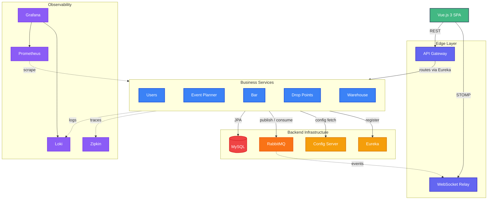
```mermaid
graph TD
    classDef frontend fill:#42b883,stroke:#35495e,color:#fff,stroke-width:2px
    classDef gateway fill:#6366f1,stroke:#4338ca,color:#fff,stroke-width:2px
    classDef service fill:#3b82f6,stroke:#1d4ed8,color:#fff,stroke-width:2px
    classDef infra fill:#f59e0b,stroke:#d97706,color:#fff,stroke-width:2px
    classDef data fill:#ef4444,stroke:#dc2626,color:#fff,stroke-width:2px
    classDef messaging fill:#f97316,stroke:#ea580c,color:#fff,stroke-width:2px
    classDef observability fill:#8b5cf6,stroke:#7c3aed,color:#fff,stroke-width:2px

    FE["Vue.js 3 SPA"]:::frontend

    subgraph EDGE["Edge Layer"]
        direction LR
        GW["API Gateway"]:::gateway
        WS["WebSocket Relay"]:::gateway
    end

    subgraph SERVICES["Business Services"]
        direction LR
        US["Users"]:::service
        EP["Event Planner"]:::service
        BS["Bar"]:::service
        DP["Drop Points"]:::service
        WH["Warehouse"]:::service
        US ~~~ EP ~~~ BS ~~~ DP ~~~ WH
    end

    subgraph BACKEND["Backend Infrastructure"]
        direction LR
        CS["Config Server"]:::infra
        EU["Eureka"]:::infra
        DB[("MySQL")]:::data
        RMQ["RabbitMQ"]:::messaging
    end

    subgraph OBS["Observability"]
        direction LR
        PROM["Prometheus"]:::observability
        GRAF["Grafana"]:::observability
        LOKI["Loki"]:::observability
        ZIP["Zipkin"]:::observability
    end

    FE -->|REST| GW
    FE -->|STOMP| WS
    RMQ -.->|events| WS

    GW -->|routes via Eureka| SERVICES

    SERVICES -->|JPA| DB
    SERVICES -->|publish / consume| RMQ
    SERVICES -->|config fetch| CS
    SERVICES -->|register| EU

    PROM -.->|scrape| SERVICES
    SERVICES -.->|logs| LOKI
    SERVICES -.->|traces| ZIP
    GRAF --> PROM & LOKI
```

---

## DDD Strategic Design

### Bounded Context Map

The system is decomposed into five bounded contexts, each owning its data and domain logic, aligned with the microservice boundary. Each context has its own database schema, ubiquitous language, and deployment unit.

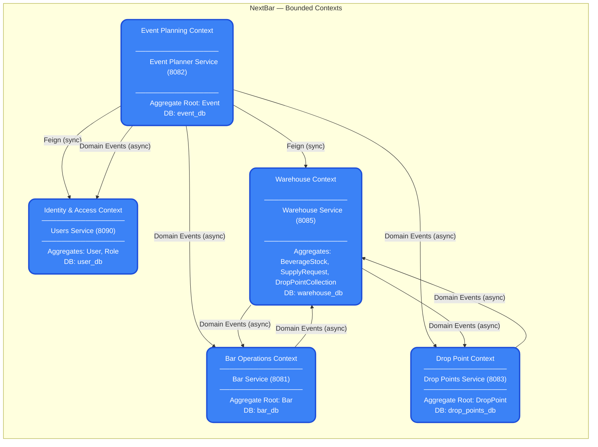
```mermaid
graph TB
    classDef context fill:#3b82f6,stroke:#1d4ed8,color:#fff,stroke-width:3px,rx:15,ry:15
    classDef shared fill:#8b5cf6,stroke:#6d28d9,color:#fff,stroke-width:2px
    classDef infra fill:#6b7280,stroke:#4b5563,color:#fff,stroke-width:2px

    subgraph SYSTEM["NextBar — Bounded Contexts"]
        direction TB

        IAC["Identity & Access Context
        ─────────────────
        Users Service (8090)
        ─────────────────
        Aggregates: User, Role
        DB: user_db"]:::context

        EPC["Event Planning Context
        ─────────────────
        Event Planner Service (8082)
        ─────────────────
        Aggregate Root: Event
        DB: event_db"]:::context

        BOC["Bar Operations Context
        ─────────────────
        Bar Service (8081)
        ─────────────────
        Aggregate Root: Bar
        DB: bar_db"]:::context

        DPC["Drop Point Context
        ─────────────────
        Drop Points Service (8083)
        ─────────────────
        Aggregate Root: DropPoint
        DB: drop_points_db"]:::context

        WHC["Warehouse Context
        ─────────────────
        Warehouse Service (8085)
        ─────────────────
        Aggregates: BeverageStock, SupplyRequest, DropPointCollection
        DB: warehouse_db"]:::context
    end

    EPC -->|"Feign (sync)"| IAC
    EPC -->|"Feign (sync)"| WHC
    EPC -->|"Domain Events (async)"| BOC
    EPC -->|"Domain Events (async)"| DPC
    EPC -->|"Domain Events (async)"| IAC
    BOC -->|"Domain Events (async)"| WHC
    DPC -->|"Domain Events (async)"| WHC
    WHC -->|"Domain Events (async)"| BOC
    WHC -->|"Domain Events (async)"| DPC
```

---

### Context Mapping Diagram

Shows the DDD context mapping patterns used between bounded contexts. Each relationship is annotated with its strategic pattern (U = Upstream, D = Downstream).

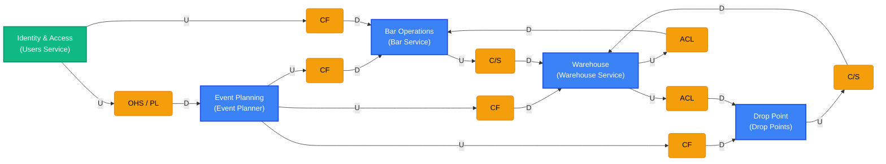
```mermaid
graph LR
    classDef upstream fill:#10b981,stroke:#059669,color:#fff,stroke-width:2px
    classDef downstream fill:#3b82f6,stroke:#1d4ed8,color:#fff,stroke-width:2px
    classDef pattern fill:#f59e0b,stroke:#d97706,color:#000,stroke-width:1px,rx:5,ry:5

    US["Identity & Access
    (Users Service)"]:::upstream
    EP["Event Planning
    (Event Planner)"]:::downstream
    BS["Bar Operations
    (Bar Service)"]:::downstream
    DP["Drop Point
    (Drop Points)"]:::downstream
    WH["Warehouse
    (Warehouse Service)"]:::downstream

    P1["OHS / PL"]:::pattern
    P2["CF"]:::pattern
    P3["CF"]:::pattern
    P4["CF"]:::pattern
    P5["CF"]:::pattern
    P6["ACL"]:::pattern
    P7["ACL"]:::pattern
    P8["C/S"]:::pattern
    P9["C/S"]:::pattern

    US -->|"U"| P1 -->|"D"| EP
    EP -->|"U"| P2 -->|"D"| BS
    EP -->|"U"| P3 -->|"D"| DP
    EP -->|"U"| P4 -->|"D"| WH
    BS -->|"U"| P8 -->|"D"| WH
    DP -->|"U"| P9 -->|"D"| WH
    WH -->|"U"| P6 -->|"D"| BS
    WH -->|"U"| P7 -->|"D"| DP
    US -->|"U"| P5 -->|"D"| BS
```

**Legend:**

| Pattern | Full Name | Description |
|---------|-----------|-------------|
| **OHS** | Open Host Service | Exposes a well-defined API consumed by multiple downstream contexts |
| **PL** | Published Language | Shared data contracts (JWT claims, DTOs) for cross-context communication |
| **CF** | Conformist | Downstream context conforms to upstream's model without translation |
| **ACL** | Anti-Corruption Layer | Downstream translates upstream events into its own domain model |
| **C/S** | Customer/Supplier | Downstream drives requirements; upstream provides data on demand |
| **U/D** | Upstream/Downstream | Direction of dependency — upstream publishes, downstream consumes |

**Relationship Details:**

| Upstream | Downstream | Pattern | Mechanism | Purpose |
|----------|------------|---------|-----------|---------|
| Identity & Access | Event Planning | OHS / PL | OpenFeign + JWT | Fetch user details, assign staff roles |
| Identity & Access | Bar, Drop Point, Warehouse, Gateway | PL | JWT claims | Authentication & authorization via shared JWT token format |
| Event Planning | Bar Operations | CF | RabbitMQ events | Create bars, bootstrap stock, complete events |
| Event Planning | Drop Point | CF | RabbitMQ events | Create drop points, bootstrap configuration |
| Event Planning | Warehouse | CF | OpenFeign | Query/reserve stock for event planning |
| Bar Operations | Warehouse | C/S | RabbitMQ events | Submit supply requests for fulfillment |
| Drop Point | Warehouse | C/S | RabbitMQ events | Notify warehouse about full drop points |
| Warehouse | Bar Operations | ACL | RabbitMQ events | Supply request status updates (translated to local SupplyStatus) |
| Warehouse | Drop Point | ACL | RabbitMQ events | Collection lifecycle updates (translated to local DropPointStatus) |

---

### Domain Events Flow

Shows all domain events flowing between bounded contexts. Events are the primary integration mechanism, following the "publish domain events" pattern from DDD.

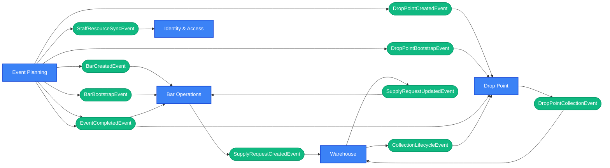
```mermaid
graph LR
    classDef context fill:#3b82f6,stroke:#1d4ed8,color:#fff,stroke-width:2px
    classDef event fill:#10b981,stroke:#059669,color:#fff,stroke-width:1px,rx:8,ry:8

    EP["Event Planning"]:::context
    BS["Bar Operations"]:::context
    DP["Drop Point"]:::context
    WH["Warehouse"]:::context
    IAC["Identity & Access"]:::context

    E1(["BarCreatedEvent"]):::event
    E2(["BarBootstrapEvent"]):::event
    E3(["DropPointCreatedEvent"]):::event
    E4(["DropPointBootstrapEvent"]):::event
    E5(["EventCompletedEvent"]):::event
    E6(["StaffResourceSyncEvent"]):::event
    E7(["SupplyRequestCreatedEvent"]):::event
    E8(["SupplyRequestUpdatedEvent"]):::event
    E9(["DropPointCollectionEvent"]):::event
    E10(["CollectionLifecycleEvent"]):::event

    EP --> E1 --> BS
    EP --> E2 --> BS
    EP --> E3 --> DP
    EP --> E4 --> DP
    EP --> E5 --> BS
    EP --> E5 --> DP
    EP --> E6 --> IAC
    BS --> E7 --> WH
    WH --> E8 --> BS
    DP --> E9 --> WH
    WH --> E10 --> DP
```

---

## DDD Tactical Design — Class Diagrams

### Identity & Access Context (Users Service)

The core identity domain. `User` is the aggregate root with `UserRoleAssignment` linking users to roles within specific services and resources.

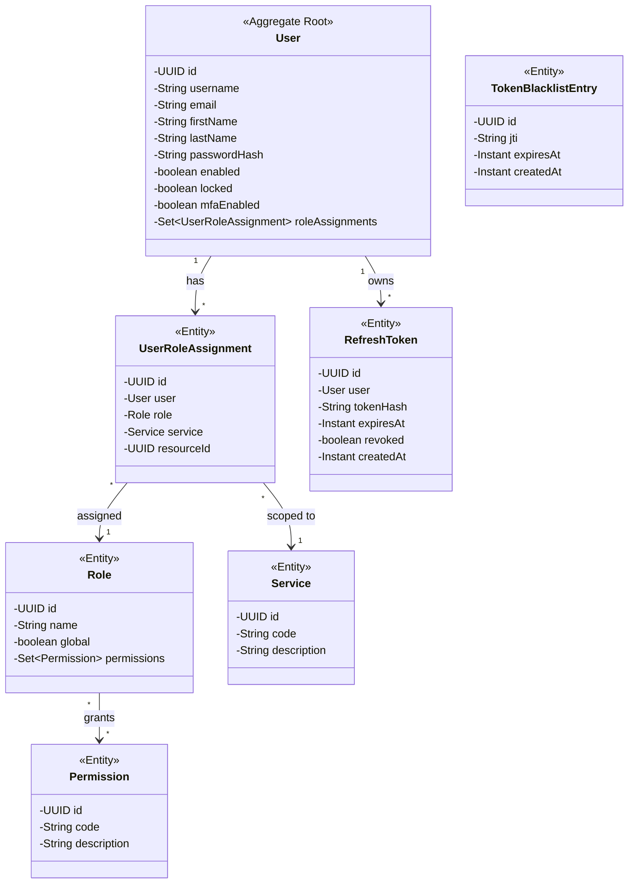
```mermaid
classDiagram
    direction TB

    class User {
        <<Aggregate Root>>
        -UUID id
        -String username
        -String email
        -String firstName
        -String lastName
        -String passwordHash
        -boolean enabled
        -boolean locked
        -boolean mfaEnabled
        -Set~UserRoleAssignment~ roleAssignments
    }

    class Role {
        <<Entity>>
        -UUID id
        -String name
        -boolean global
        -Set~Permission~ permissions
    }

    class Permission {
        <<Entity>>
        -UUID id
        -String code
        -String description
    }

    class Service {
        <<Entity>>
        -UUID id
        -String code
        -String description
    }

    class UserRoleAssignment {
        <<Entity>>
        -UUID id
        -User user
        -Role role
        -Service service
        -UUID resourceId
    }

    class RefreshToken {
        <<Entity>>
        -UUID id
        -User user
        -String tokenHash
        -Instant expiresAt
        -boolean revoked
        -Instant createdAt
    }

    class TokenBlacklistEntry {
        <<Entity>>
        -UUID id
        -String jti
        -Instant expiresAt
        -Instant createdAt
    }

    User "1" --> "*" UserRoleAssignment : has
    UserRoleAssignment "*" --> "1" Role : assigned
    UserRoleAssignment "*" --> "1" Service : scoped to
    Role "*" --> "*" Permission : grants
    User "1" --> "*" RefreshToken : owns
```

---

### Event Planning Context (Event Planner Service)

The orchestration domain. `Event` is the aggregate root that owns `Bar`, `DropPoint`, and their stock configurations. This context coordinates the entire event lifecycle.

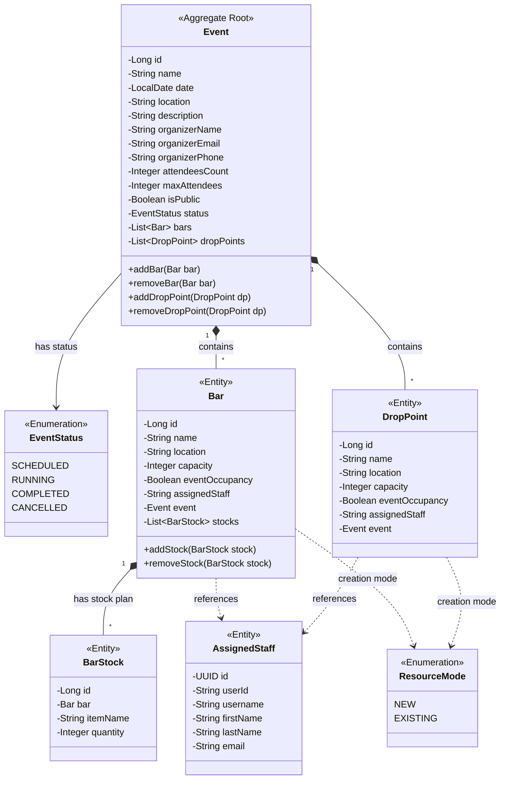
```mermaid
classDiagram
    direction TB

    class Event {
        <<Aggregate Root>>
        -Long id
        -String name
        -LocalDate date
        -String location
        -String description
        -String organizerName
        -String organizerEmail
        -String organizerPhone
        -Integer attendeesCount
        -Integer maxAttendees
        -Boolean isPublic
        -EventStatus status
        -List~Bar~ bars
        -List~DropPoint~ dropPoints
        +addBar(Bar bar)
        +removeBar(Bar bar)
        +addDropPoint(DropPoint dp)
        +removeDropPoint(DropPoint dp)
    }

    class EventStatus {
        <<Enumeration>>
        SCHEDULED
        RUNNING
        COMPLETED
        CANCELLED
    }

    class Bar {
        <<Entity>>
        -Long id
        -String name
        -String location
        -Integer capacity
        -Boolean eventOccupancy
        -String assignedStaff
        -Event event
        -List~BarStock~ stocks
        +addStock(BarStock stock)
        +removeStock(BarStock stock)
    }

    class BarStock {
        <<Entity>>
        -Long id
        -Bar bar
        -String itemName
        -Integer quantity
    }

    class DropPoint {
        <<Entity>>
        -Long id
        -String name
        -String location
        -Integer capacity
        -Boolean eventOccupancy
        -String assignedStaff
        -Event event
    }

    class AssignedStaff {
        <<Entity>>
        -UUID id
        -String userId
        -String username
        -String firstName
        -String lastName
        -String email
    }

    class ResourceMode {
        <<Enumeration>>
        NEW
        EXISTING
    }

    Event "1" *-- "*" Bar : contains
    Event "1" *-- "*" DropPoint : contains
    Event --> EventStatus : has status
    Bar "1" *-- "*" BarStock : has stock plan
    Bar ..> AssignedStaff : references
    DropPoint ..> AssignedStaff : references
    Bar ..> ResourceMode : creation mode
    DropPoint ..> ResourceMode : creation mode
```

---

### Bar Operations Context (Bar Service)

The runtime operations domain for bars during active events. `Bar` is the aggregate root. `SupplyItem` is a value object embedded within `SupplyRequest`.

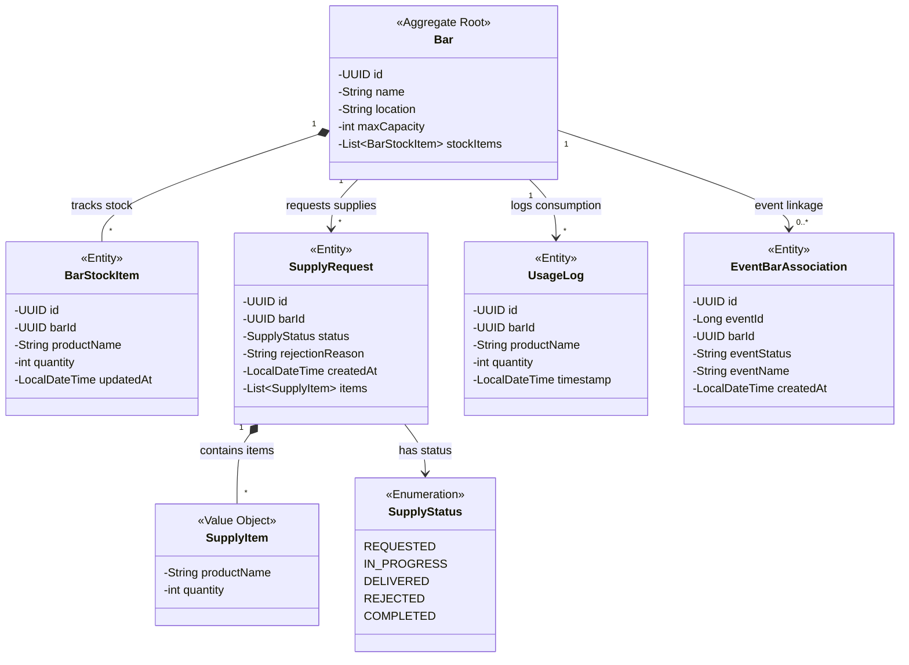
```mermaid
classDiagram
    direction TB

    class Bar {
        <<Aggregate Root>>
        -UUID id
        -String name
        -String location
        -int maxCapacity
        -List~BarStockItem~ stockItems
    }

    class BarStockItem {
        <<Entity>>
        -UUID id
        -UUID barId
        -String productName
        -int quantity
        -LocalDateTime updatedAt
    }

    class SupplyRequest {
        <<Entity>>
        -UUID id
        -UUID barId
        -SupplyStatus status
        -String rejectionReason
        -LocalDateTime createdAt
        -List~SupplyItem~ items
    }

    class SupplyItem {
        <<Value Object>>
        -String productName
        -int quantity
    }

    class SupplyStatus {
        <<Enumeration>>
        REQUESTED
        IN_PROGRESS
        DELIVERED
        REJECTED
        COMPLETED
    }

    class UsageLog {
        <<Entity>>
        -UUID id
        -UUID barId
        -String productName
        -int quantity
        -LocalDateTime timestamp
    }

    class EventBarAssociation {
        <<Entity>>
        -UUID id
        -Long eventId
        -UUID barId
        -String eventStatus
        -String eventName
        -LocalDateTime createdAt
    }

    Bar "1" *-- "*" BarStockItem : tracks stock
    Bar "1" --> "*" UsageLog : logs consumption
    Bar "1" --> "*" SupplyRequest : requests supplies
    SupplyRequest "1" *-- "*" SupplyItem : contains items
    SupplyRequest --> SupplyStatus : has status
    Bar "1" --> "0..*" EventBarAssociation : event linkage
```

---

### Drop Point Context (Drop Points Service)

The bottle recycling domain. `DropPoint` is the aggregate root with a status-driven lifecycle tracking collection readiness.

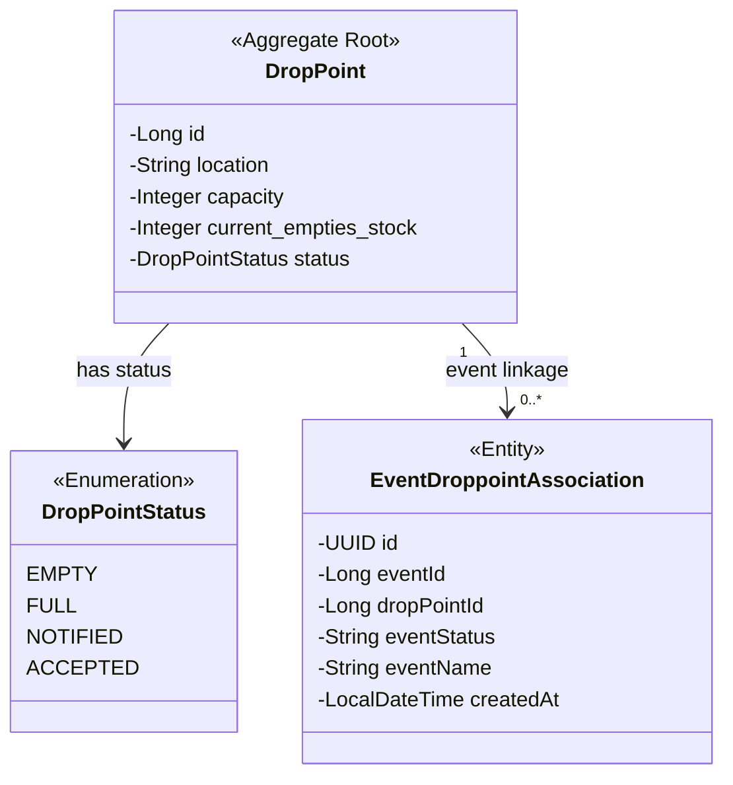
```mermaid
classDiagram
    direction TB

    class DropPoint {
        <<Aggregate Root>>
        -Long id
        -String location
        -Integer capacity
        -Integer current_empties_stock
        -DropPointStatus status
    }

    class DropPointStatus {
        <<Enumeration>>
        EMPTY
        FULL
        NOTIFIED
        ACCEPTED
    }

    class EventDroppointAssociation {
        <<Entity>>
        -UUID id
        -Long eventId
        -Long dropPointId
        -String eventStatus
        -String eventName
        -LocalDateTime createdAt
    }

    DropPoint --> DropPointStatus : has status
    DropPoint "1" --> "0..*" EventDroppointAssociation : event linkage
```

---

### Warehouse Context (Warehouse Service)

The most domain-rich context. `BeverageStock` contains business logic for stock management with optimistic locking. `DropPointCollection` implements a state machine for the collection workflow. `SupplyRequest` tracks the fulfillment pipeline from bars.

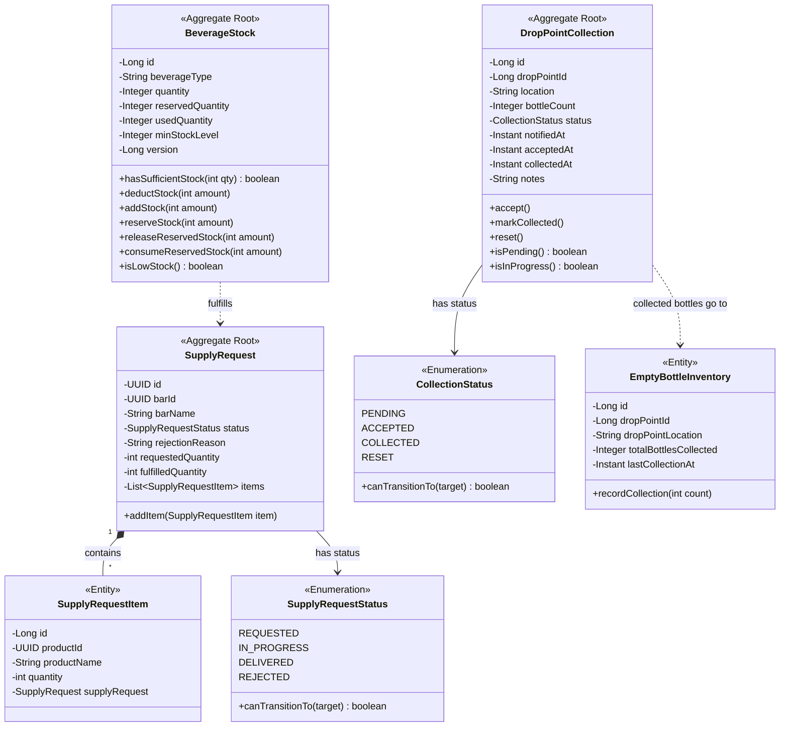
```mermaid
classDiagram
    direction TB

    class BeverageStock {
        <<Aggregate Root>>
        -Long id
        -String beverageType
        -Integer quantity
        -Integer reservedQuantity
        -Integer usedQuantity
        -Integer minStockLevel
        -Long version
        +hasSufficientStock(int qty) boolean
        +deductStock(int amount)
        +addStock(int amount)
        +reserveStock(int amount)
        +releaseReservedStock(int amount)
        +consumeReservedStock(int amount)
        +isLowStock() boolean
    }

    class SupplyRequest {
        <<Aggregate Root>>
        -UUID id
        -UUID barId
        -String barName
        -SupplyRequestStatus status
        -String rejectionReason
        -int requestedQuantity
        -int fulfilledQuantity
        -List~SupplyRequestItem~ items
        +addItem(SupplyRequestItem item)
    }

    class SupplyRequestItem {
        <<Entity>>
        -Long id
        -UUID productId
        -String productName
        -int quantity
        -SupplyRequest supplyRequest
    }

    class SupplyRequestStatus {
        <<Enumeration>>
        REQUESTED
        IN_PROGRESS
        DELIVERED
        REJECTED
        +canTransitionTo(target) boolean
    }

    class DropPointCollection {
        <<Aggregate Root>>
        -Long id
        -Long dropPointId
        -String location
        -Integer bottleCount
        -CollectionStatus status
        -Instant notifiedAt
        -Instant acceptedAt
        -Instant collectedAt
        -String notes
        +accept()
        +markCollected()
        +reset()
        +isPending() boolean
        +isInProgress() boolean
    }

    class CollectionStatus {
        <<Enumeration>>
        PENDING
        ACCEPTED
        COLLECTED
        RESET
        +canTransitionTo(target) boolean
    }

    class EmptyBottleInventory {
        <<Entity>>
        -Long id
        -Long dropPointId
        -String dropPointLocation
        -Integer totalBottlesCollected
        -Instant lastCollectionAt
        +recordCollection(int count)
    }

    SupplyRequest "1" *-- "*" SupplyRequestItem : contains
    SupplyRequest --> SupplyRequestStatus : has status
    DropPointCollection --> CollectionStatus : has status
    DropPointCollection ..> EmptyBottleInventory : collected bottles go to
    BeverageStock ..> SupplyRequest : fulfills
```

---

## State Machine Diagrams

### Event Lifecycle

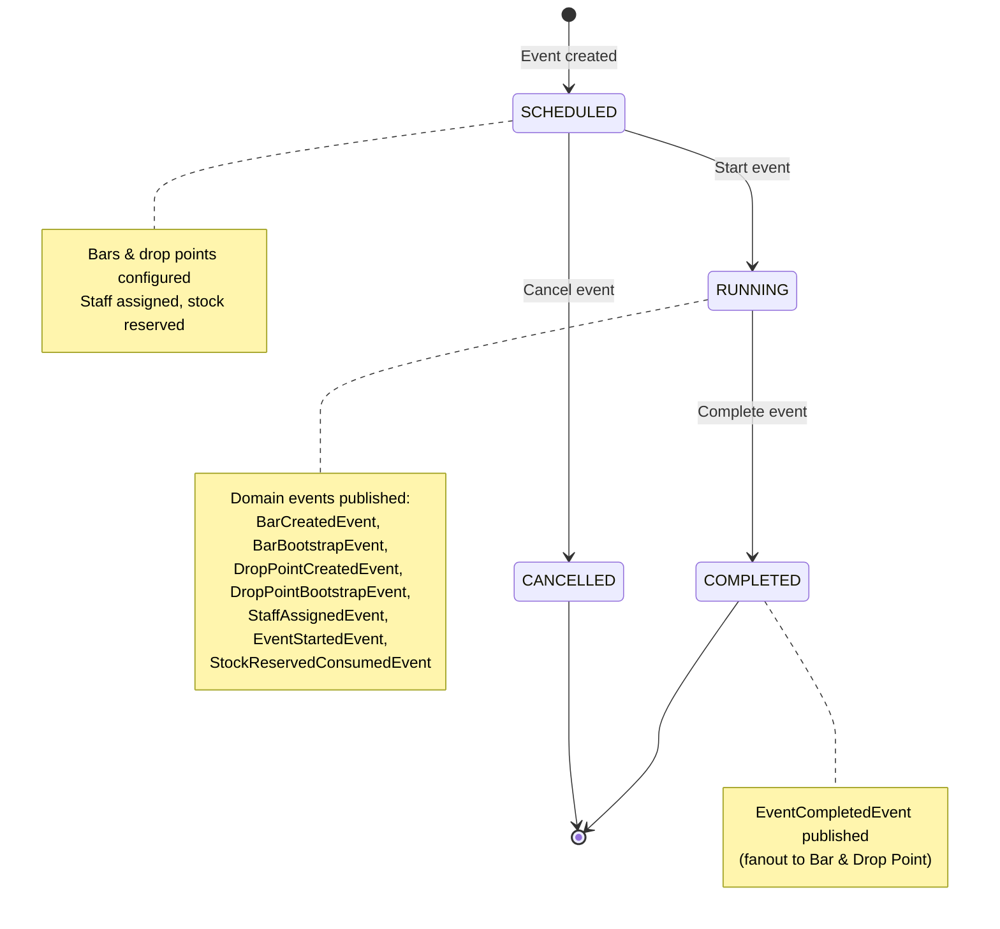
```mermaid
stateDiagram-v2
    [*] --> SCHEDULED : Event created

    SCHEDULED --> RUNNING : Start event
    SCHEDULED --> CANCELLED : Cancel event

    RUNNING --> COMPLETED : Complete event

    COMPLETED --> [*]
    CANCELLED --> [*]

    note right of SCHEDULED
        Bars & drop points configured
        Staff assigned, stock reserved
    end note

    note right of RUNNING
        Domain events published:
        BarCreatedEvent, BarBootstrapEvent,
        DropPointCreatedEvent, DropPointBootstrapEvent,
        StaffAssignedEvent, EventStartedEvent,
        StockReservedConsumedEvent
    end note

    note right of COMPLETED
        EventCompletedEvent published
        (fanout to Bar & Drop Point)
    end note
```

---

### Supply Request Lifecycle (Bar → Warehouse)

Shows the cross-context lifecycle where the supply request originates in the Bar context, gets mirrored in the Warehouse context, and status updates flow back.

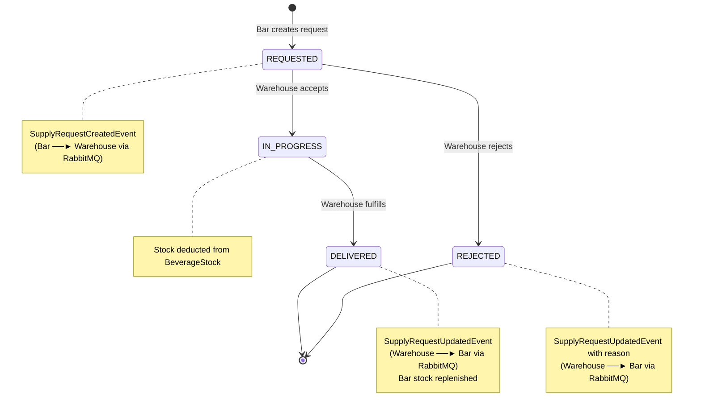
```mermaid
stateDiagram-v2
    [*] --> REQUESTED : Bar creates request

    REQUESTED --> IN_PROGRESS : Warehouse accepts
    REQUESTED --> REJECTED : Warehouse rejects

    IN_PROGRESS --> DELIVERED : Warehouse fulfills

    DELIVERED --> [*]
    REJECTED --> [*]

    note right of REQUESTED
        SupplyRequestCreatedEvent
        (Bar ──► Warehouse via RabbitMQ)
    end note

    note right of IN_PROGRESS
        Stock deducted from BeverageStock
    end note

    note right of DELIVERED
        SupplyRequestUpdatedEvent
        (Warehouse ──► Bar via RabbitMQ)
        Bar stock replenished
    end note

    note right of REJECTED
        SupplyRequestUpdatedEvent with reason
        (Warehouse ──► Bar via RabbitMQ)
    end note
```

---

### Drop Point Collection Lifecycle

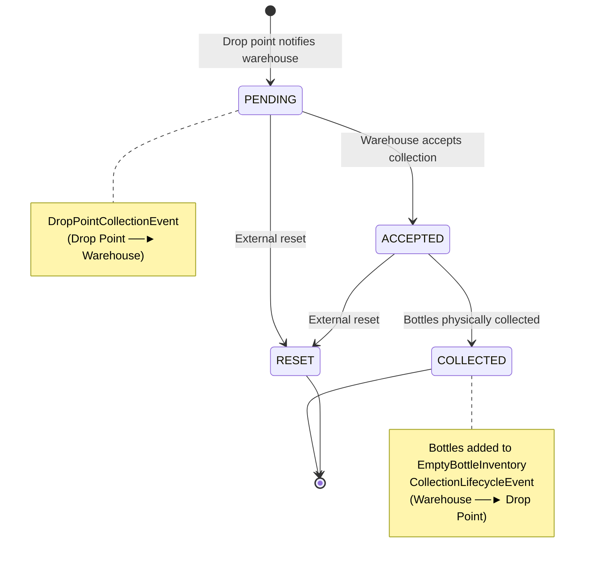
```mermaid
stateDiagram-v2
    [*] --> PENDING : Drop point notifies warehouse

    PENDING --> ACCEPTED : Warehouse accepts collection
    PENDING --> RESET : External reset

    ACCEPTED --> COLLECTED : Bottles physically collected
    ACCEPTED --> RESET : External reset

    COLLECTED --> [*]
    RESET --> [*]

    note right of PENDING
        DropPointCollectionEvent
        (Drop Point ──► Warehouse)
    end note

    note right of COLLECTED
        Bottles added to EmptyBottleInventory
        CollectionLifecycleEvent
        (Warehouse ──► Drop Point)
    end note
```

---

### Drop Point Status Lifecycle

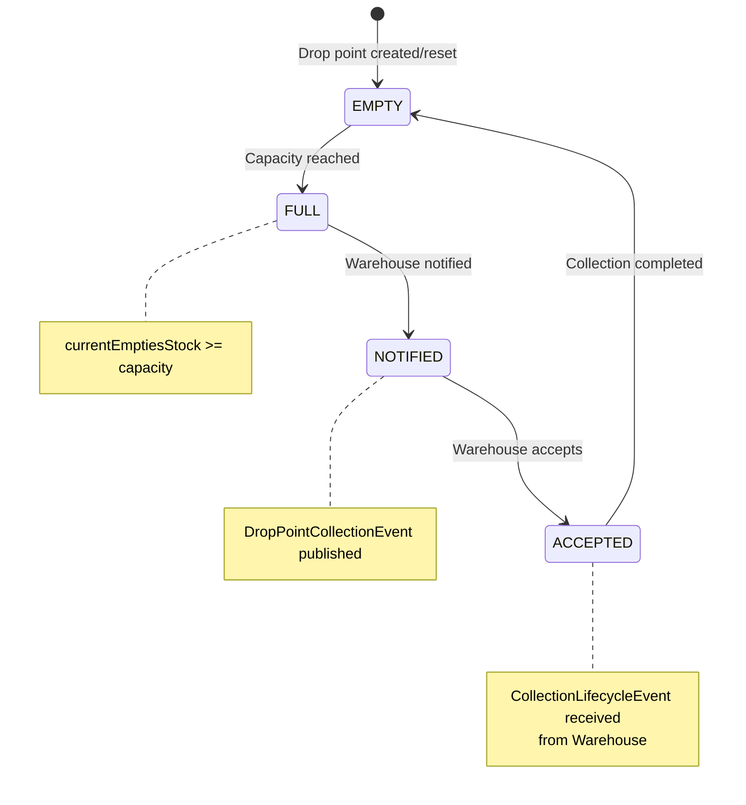
```mermaid
stateDiagram-v2
    [*] --> EMPTY : Drop point created/reset

    EMPTY --> FULL : Capacity reached

    FULL --> NOTIFIED : Warehouse notified

    NOTIFIED --> ACCEPTED : Warehouse accepts

    ACCEPTED --> EMPTY : Collection completed

    note right of FULL
        currentEmptiesStock >= capacity
    end note

    note right of NOTIFIED
        DropPointCollectionEvent published
    end note

    note right of ACCEPTED
        CollectionLifecycleEvent received
        from Warehouse
    end note
```

---

## Infrastructure Diagrams

### RabbitMQ Active Service-to-Service Flows

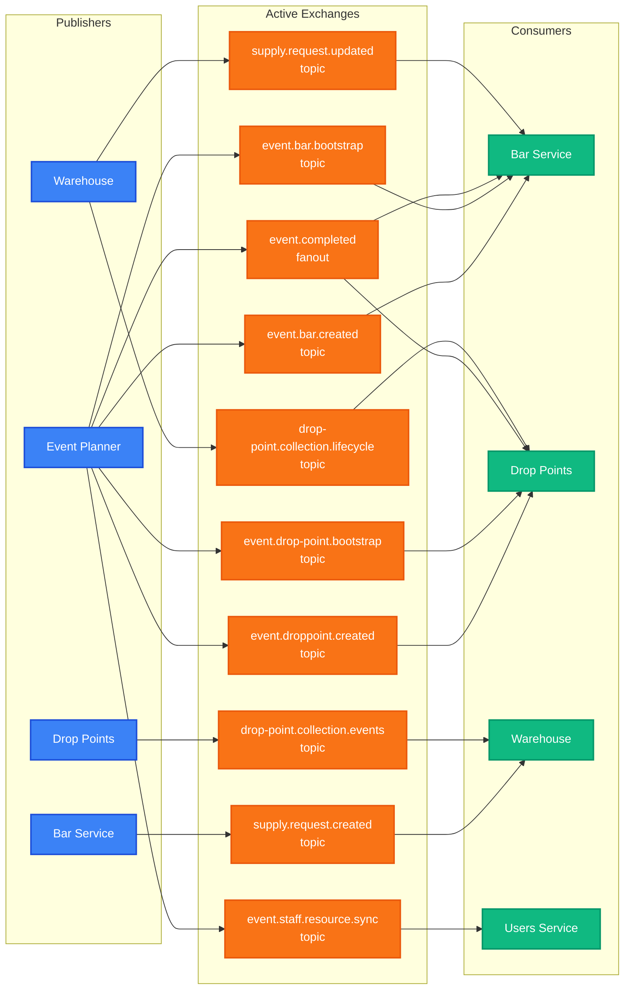
```mermaid
graph LR
    classDef publisher fill:#3b82f6,stroke:#1d4ed8,color:#fff,stroke-width:2px
    classDef exchange fill:#f97316,stroke:#ea580c,color:#fff,stroke-width:2px
    classDef consumer fill:#10b981,stroke:#059669,color:#fff,stroke-width:2px

    subgraph PUB["Publishers"]
        EP["Event Planner"]:::publisher
        BS["Bar Service"]:::publisher
        DP["Drop Points"]:::publisher
        WH["Warehouse"]:::publisher
    end

    subgraph EXCHANGES["Active Exchanges"]
        E1["event.bar.created<br/>topic"]:::exchange
        E2["event.bar.bootstrap<br/>topic"]:::exchange
        E3["event.droppoint.created<br/>topic"]:::exchange
        E4["event.drop-point.bootstrap<br/>topic"]:::exchange
        E5["event.completed<br/>fanout"]:::exchange
        E6["event.staff.resource.sync<br/>topic"]:::exchange
        E7["supply.request.created<br/>topic"]:::exchange
        E8["supply.request.updated<br/>topic"]:::exchange
        E9["drop-point.collection.events<br/>topic"]:::exchange
        E10["drop-point.collection.lifecycle<br/>topic"]:::exchange
    end

    subgraph CON["Consumers"]
        BS2["Bar Service"]:::consumer
        DP2["Drop Points"]:::consumer
        WH2["Warehouse"]:::consumer
        US2["Users Service"]:::consumer
    end

    EP --> E1 --> BS2
    EP --> E2 --> BS2
    EP --> E3 --> DP2
    EP --> E4 --> DP2
    EP --> E5 --> BS2 & DP2
    EP --> E6 --> US2

    BS --> E7 --> WH2

    WH --> E8 --> BS2
    WH --> E10 --> DP2

    DP --> E9 --> WH2
```

---

### RabbitMQ WebSocket Broadcast Path

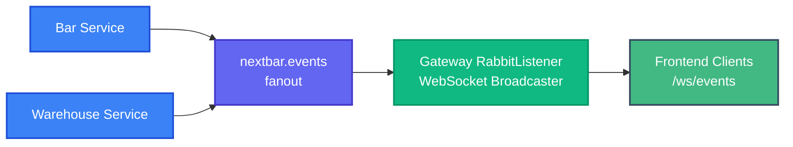
```mermaid
graph LR
    classDef publisher fill:#3b82f6,stroke:#1d4ed8,color:#fff,stroke-width:2px
    classDef exchange fill:#6366f1,stroke:#4338ca,color:#fff,stroke-width:2px
    classDef gateway fill:#10b981,stroke:#059669,color:#fff,stroke-width:2px
    classDef frontend fill:#42b883,stroke:#35495e,color:#fff,stroke-width:2px

    BS["Bar Service"]:::publisher
    WH["Warehouse Service"]:::publisher
    EX["nextbar.events<br/>fanout"]:::exchange
    GW["Gateway RabbitListener<br/>WebSocket Broadcaster"]:::gateway
    FE["Frontend Clients<br/>/ws/events"]:::frontend

    BS --> EX
    WH --> EX
    EX --> GW --> FE
```

---

### Published But Currently Unconsumed Exchanges

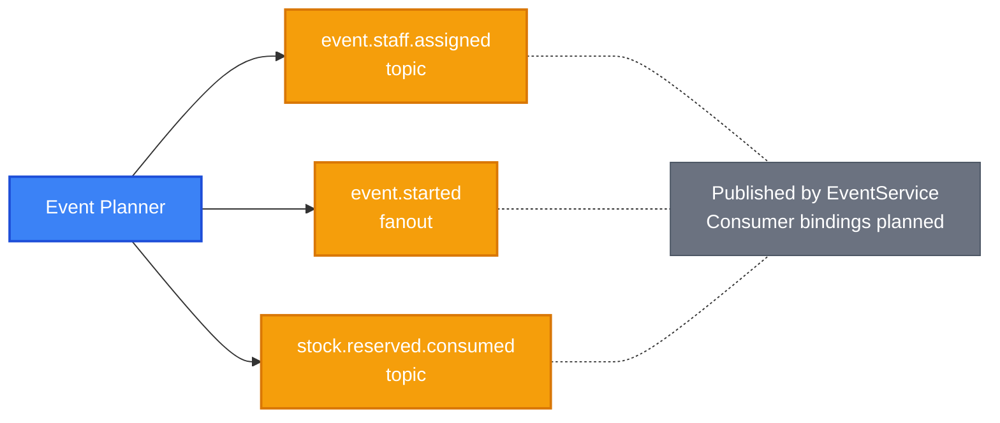
```mermaid
graph LR
    classDef publisher fill:#3b82f6,stroke:#1d4ed8,color:#fff,stroke-width:2px
    classDef exchange fill:#f59e0b,stroke:#d97706,color:#fff,stroke-width:2px
    classDef note fill:#6b7280,stroke:#4b5563,color:#fff,stroke-width:1px

    EP["Event Planner"]:::publisher

    E1["event.staff.assigned<br/>topic"]:::exchange
    E2["event.started<br/>fanout"]:::exchange
    E3["stock.reserved.consumed<br/>topic"]:::exchange
    N["Published by EventService<br/>Consumer bindings planned"]:::note

    EP --> E1
    EP --> E2
    EP --> E3
    E1 -..- N
    E2 -..- N
    E3 -..- N
```

---

### Synchronous Inter-Service Communication

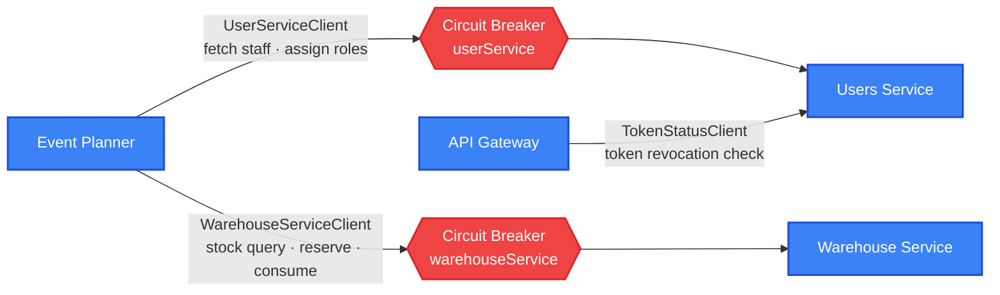
```mermaid
graph LR
    classDef svc fill:#3b82f6,stroke:#1d4ed8,color:#fff,stroke-width:2px
    classDef cb fill:#ef4444,stroke:#dc2626,color:#fff,stroke-width:2px

    EP["Event Planner"]:::svc
    US["Users Service"]:::svc
    WH["Warehouse Service"]:::svc
    GW["API Gateway"]:::svc

    CB1{{"Circuit Breaker<br/>userService"}}:::cb
    CB2{{"Circuit Breaker<br/>warehouseService"}}:::cb

    EP -- "UserServiceClient<br/>fetch staff · assign roles" --> CB1 --> US
    EP -- "WarehouseServiceClient<br/>stock query · reserve · consume" --> CB2 --> WH
    GW -- "TokenStatusClient<br/>token revocation check" --> US
```

---

### Docker Compose Infrastructure

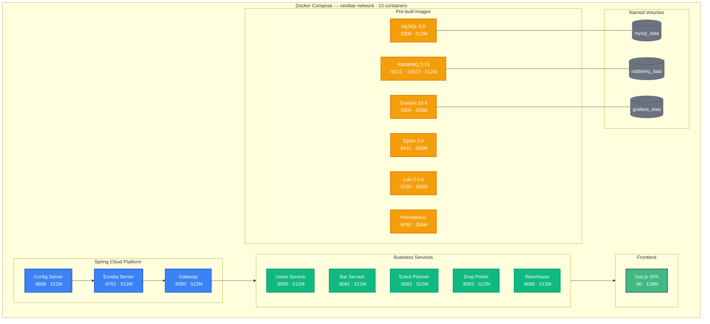
```mermaid
graph TB
    classDef built fill:#3b82f6,stroke:#1d4ed8,color:#fff,stroke-width:2px
    classDef image fill:#f59e0b,stroke:#d97706,color:#fff,stroke-width:2px
    classDef volume fill:#6b7280,stroke:#4b5563,color:#fff,stroke-width:1px
    classDef biz fill:#10b981,stroke:#059669,color:#fff,stroke-width:2px
    classDef fe fill:#42b883,stroke:#35495e,color:#fff,stroke-width:2px

    subgraph DOCKER["Docker Compose — nextbar-network · 15 containers"]

        subgraph INFRA["Pre-built Images"]
            MYSQL["MySQL 8.0<br/>:3306 · 512M"]:::image
            RMQ["RabbitMQ 3.13<br/>:5672 · :15672 · 512M"]:::image
            ZIP["Zipkin 3.4<br/>:9411 · 256M"]:::image
            LOKI["Loki 2.9.6<br/>:3100 · 256M"]:::image
            PROM["Prometheus<br/>:9090 · 256M"]:::image
            GRAF["Grafana 10.4<br/>:3000 · 256M"]:::image
        end

        subgraph SPRING["Spring Cloud Platform"]
            CS["Config Server<br/>:8888 · 512M"]:::built
            EU["Eureka Server<br/>:8761 · 512M"]:::built
            GW["Gateway<br/>:8080 · 512M"]:::built
        end

        subgraph BIZ["Business Services"]
            US["Users Service<br/>:8090 · 512M"]:::biz
            BS["Bar Service<br/>:8081 · 512M"]:::biz
            EP["Event Planner<br/>:8082 · 512M"]:::biz
            DP["Drop Points<br/>:8083 · 512M"]:::biz
            WH["Warehouse<br/>:8085 · 512M"]:::biz
        end

        subgraph FE_GRP["Frontend"]
            FE["Vue.js SPA<br/>:80 · 128M"]:::fe
        end

        subgraph VOLS["Named Volumes"]
            V1[("mysql_data")]:::volume
            V2[("rabbitmq_data")]:::volume
            V3[("grafana_data")]:::volume
        end
    end

    CS --> EU
    EU --> GW
    GW --> BIZ
    BIZ --> FE_GRP
    MYSQL --- V1
    RMQ --- V2
    GRAF --- V3
```

---

### CI/CD Pipeline

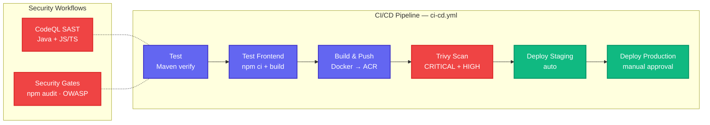
```mermaid
graph LR
    classDef stage fill:#6366f1,stroke:#4338ca,color:#fff,stroke-width:2px
    classDef scan fill:#ef4444,stroke:#dc2626,color:#fff,stroke-width:2px
    classDef env fill:#10b981,stroke:#059669,color:#fff,stroke-width:2px

    subgraph PIPELINE["CI/CD Pipeline — ci-cd.yml"]
        T1["Test<br/>Maven verify"]:::stage
        T2["Test Frontend<br/>npm ci + build"]:::stage
        T3["Build & Push<br/>Docker → ACR"]:::stage
        TV["Trivy Scan<br/>CRITICAL + HIGH"]:::scan
        T4["Deploy Staging<br/>auto"]:::env
        T5["Deploy Production<br/>manual approval"]:::env
    end

    subgraph SECURITY["Security Workflows"]
        S1["CodeQL SAST<br/>Java + JS/TS"]:::scan
        S2["Security Gates<br/>npm audit · OWASP"]:::scan
    end

    T1 --> T2 --> T3 --> TV --> T4 --> T5
    S1 -.- T1
    S2 -.- T1
```

---

### Service Startup Order

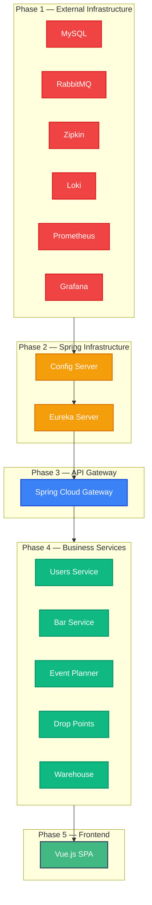
```mermaid
graph TD
    classDef phase1 fill:#ef4444,stroke:#dc2626,color:#fff,stroke-width:2px
    classDef phase2 fill:#f59e0b,stroke:#d97706,color:#fff,stroke-width:2px
    classDef phase3 fill:#3b82f6,stroke:#1d4ed8,color:#fff,stroke-width:2px
    classDef phase4 fill:#10b981,stroke:#059669,color:#fff,stroke-width:2px
    classDef phase5 fill:#42b883,stroke:#35495e,color:#fff,stroke-width:2px

    subgraph P1["Phase 1 — External Infrastructure"]
        MYSQL["MySQL"]:::phase1
        RMQ["RabbitMQ"]:::phase1
        ZIP["Zipkin"]:::phase1
        LOKI["Loki"]:::phase1
        PROM["Prometheus"]:::phase1
        GRAF["Grafana"]:::phase1
    end

    subgraph P2["Phase 2 — Spring Infrastructure"]
        CS["Config Server"]:::phase2
        EU["Eureka Server"]:::phase2
    end

    subgraph P3["Phase 3 — API Gateway"]
        GW["Spring Cloud Gateway"]:::phase3
    end

    subgraph P4["Phase 4 — Business Services"]
        US["Users Service"]:::phase4
        BS["Bar Service"]:::phase4
        EP["Event Planner"]:::phase4
        DP["Drop Points"]:::phase4
        WH["Warehouse"]:::phase4
    end

    subgraph P5["Phase 5 — Frontend"]
        FE["Vue.js SPA"]:::phase5
    end

    P1 --> CS
    CS --> EU
    EU --> GW
    GW --> P4
    P4 --> FE
```
