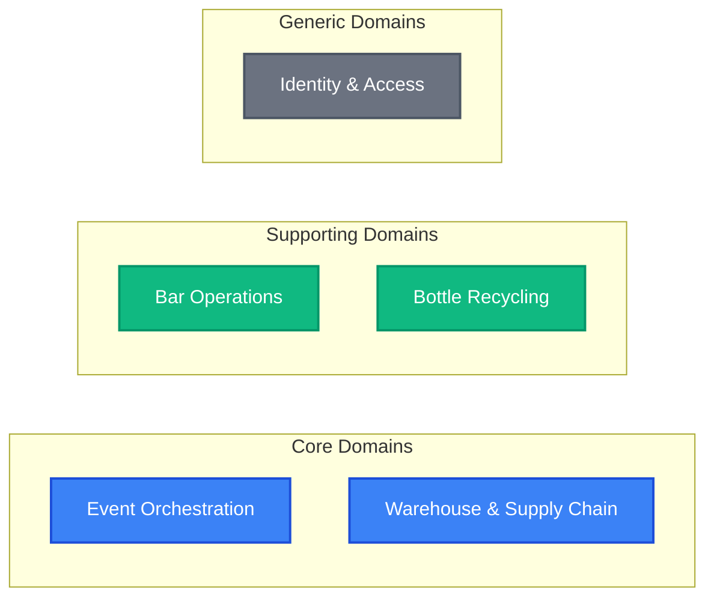
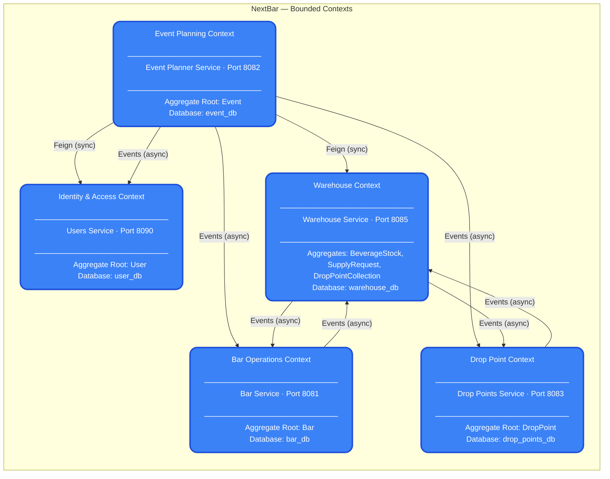
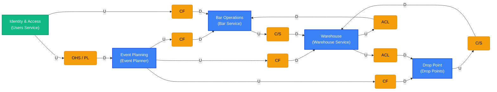
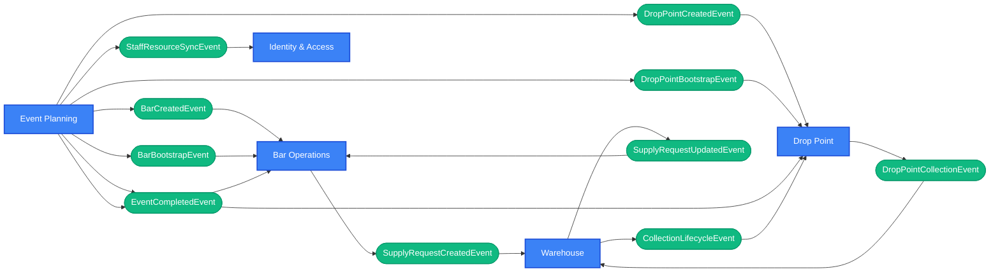

# NextBar — DDD Strategic Design

This document presents the **Strategic Design** decisions of the NextBar system, answering the **"What"** we are building and **"Why"** the domain is decomposed the way it is. It follows the practices defined by Eric Evans in _Domain-Driven Design: Tackling Complexity in the Heart of Software_.

---

## Table of Contents

- [Problem Space](#problem-space)
- [Sub-domain Classification](#sub-domain-classification)
- [Bounded Contexts](#bounded-contexts)
- [Context Mapping](#context-mapping)
- [Ubiquitous Language](#ubiquitous-language)
- [Bounded Context Canvases](#bounded-context-canvases)

---

## Problem Space

### Domain Overview

NextBar operates in the **event beverage management** domain. At large-scale events (festivals, concerts, corporate gatherings), organizers need to manage a complex supply chain: beverages flow from a central warehouse to multiple distributed bars, while empty bottles flow back from attendees through designated drop points to the warehouse.

### Core Problem

The core challenge is **coordination under pressure**: dozens of bars need stock replenishment in real time, drop points fill up unpredictably, and event planners must orchestrate staffing and resource allocation ahead of time — all while maintaining accurate inventory counts across a distributed topology.

### Sub-problems Identified

1. **Event Orchestration** — How to plan, configure, and activate an event with all its physical resources (bars, drop points, staff).
2. **Stock Management** — How to track beverage quantities at every point in the chain (warehouse, bar, in-transit).
3. **Supply Chain Automation** — How to detect low stock at bars and trigger replenishment without human intervention.
4. **Bottle Recycling** — How to monitor drop point capacity, alert the warehouse, and process collections.
5. **Identity & Access** — How to authenticate users and enforce role-based authorization scoped per service and resource.

---

## Sub-domain Classification

Each sub-problem maps to a **sub-domain** classified by its strategic importance to the business:



| Sub-domain | Type | Justification |
|------------|------|---------------|
| **Event Orchestration** | Core | Primary competitive differentiator; complex lifecycle, cross-context coordination, and resource allocation logic unique to this business |
| **Warehouse & Supply Chain** | Core | Central to the value proposition; rich business rules for stock reservation, fulfillment state machines, and collection workflows |
| **Bar Operations** | Supporting | Essential but operationally focused; supports the core by executing drink service and triggering supply requests |
| **Bottle Recycling** | Supporting | Enables the closed-loop recycling experience; relatively simple domain logic (capacity tracking, status transitions) |
| **Identity & Access** | Generic | Standard authentication and RBAC; no domain-specific innovation, could theoretically be replaced by an off-the-shelf IAM provider |

---

## Bounded Contexts

Each sub-domain is implemented as an isolated **Bounded Context** with its own database, deployment unit, and ubiquitous language. The context boundaries align 1:1 with the microservice boundaries.



### Why These Boundaries?

| Decision | Rationale |
|----------|-----------|
| **Event Planner is separate from Bar and Drop Point** | During planning, bars and drop points are _configurations_. During runtime, they become _independent operational units_. Separating the planning context from execution contexts allows the Event Planner to own the lifecycle while downstream services own the operations. |
| **Bar and Warehouse are separate contexts** | A bar's "stock" and the warehouse's "stock" have fundamentally different semantics. Bar stock is consumed at the point of sale, while warehouse stock supports reservation, fulfillment, and optimistic concurrency. Merging them would couple incompatible business rules. |
| **Drop Point is its own context (not part of Warehouse)** | Drop points have their own state machine (EMPTY → FULL → NOTIFIED → ACCEPTED) and their own physical deployment lifecycle. The warehouse only cares about _collection tasks_, not the internal state of each drop point. |
| **Identity & Access is isolated** | Security concerns (passwords, tokens, RBAC) must not leak into business contexts. All services consume a Published Language (JWT claims) without depending on the Identity context's internals. |

---

## Context Mapping

The following diagram shows the DDD integration patterns used between bounded contexts. Each relationship is annotated with its strategic pattern.



### Pattern Legend

| Pattern | Full Name | Description |
|---------|-----------|-------------|
| **OHS** | Open Host Service | Exposes a well-defined API consumed by multiple downstream contexts |
| **PL** | Published Language | Shared data contracts (JWT claims, DTOs) for cross-context communication |
| **CF** | Conformist | Downstream context conforms to upstream's model without translation |
| **ACL** | Anti-Corruption Layer | Downstream translates upstream events into its own domain model |
| **C/S** | Customer/Supplier | Downstream drives requirements; upstream provides data on demand |
| **U/D** | Upstream/Downstream | Direction of dependency |

### Relationship Details

| Upstream | Downstream | Pattern | Mechanism | Purpose |
|----------|------------|---------|-----------|---------|
| Identity & Access | All services | OHS / PL | JWT claims | Authentication and authorization via standardized token format |
| Event Planning | Bar Operations | CF | RabbitMQ events | Bootstrap bars, create stock, signal event completion |
| Event Planning | Drop Point | CF | RabbitMQ events | Bootstrap drop points, signal event completion |
| Event Planning | Warehouse | CF | OpenFeign | Query and reserve stock for event planning |
| Event Planning | Identity & Access | CF | OpenFeign | Fetch user details for staff assignment |
| Bar Operations | Warehouse | C/S | RabbitMQ events | Bar requests supply; warehouse fulfills on demand |
| Drop Point | Warehouse | C/S | RabbitMQ events | Drop point notifies full capacity; warehouse collects on demand |
| Warehouse | Bar Operations | ACL | RabbitMQ events | Supply request updates translated from `SupplyRequestStatus` to local `SupplyStatus` |
| Warehouse | Drop Point | ACL | RabbitMQ events | Collection lifecycle updates translated from `CollectionStatus` to local `DropPointStatus` |

### Domain Events Flow

All domain events flowing between bounded contexts:



---

## Ubiquitous Language

A shared vocabulary, strictly defined per context, ensuring every term has exactly one unambiguous meaning.

### System-Wide Terms

| Term | Definition |
|------|-----------|
| **Event** | A large-scale public gathering (festival, concert) where beverage services are provided |
| **Staff** | A registered user on the platform, possessing specific roles scoped to services or resources |
| **Domain Event** | An immutable record of something that happened in the domain, published asynchronously via RabbitMQ |

### Event Planning Context

| Term | Definition |
|------|-----------|
| **Event Planner** | A user role responsible for orchestrating the overall event lifecycle and resource planning |
| **Resource Allocation** | The act of attaching physical/logical infrastructure (bars, drop points) to an event |
| **Event Lifecycle** | The progression of an event through SCHEDULED → RUNNING → COMPLETED (or CANCELLED) |
| **Bootstrap** | The act of projecting event planning configurations into downstream operational contexts |

### Bar Operations Context

| Term | Definition |
|------|-----------|
| **Bar** | An operational unit located at an event that serves beverages and tracks local stock |
| **Local Stock** | The inventory of beverages physically present at a specific bar (distinct from warehouse stock) |
| **Usage Log** | An immutable record of every drink served, tracking product, quantity, and timestamp |
| **Supply Request** | A formal order asking the warehouse to replenish specific depleted stock items |
| **Auto-Replenishment** | The system-initiated process of creating a supply request when stock drops to threshold (<=5) |

### Warehouse Context

| Term | Definition |
|------|-----------|
| **Beverage Stock** | The master inventory of all beverages held in the central storage facility |
| **Reserved Quantity** | Stock earmarked for a specific purpose but not yet physically moved |
| **Fulfillment** | The process of accepting, picking, and physically delivering items for a supply request |
| **Collection Task** | A workflow to physically retrieve accumulated empty bottles from a drop point |
| **Empty Bottle Inventory** | The aggregated count of all returned and processed empty bottles stored in the warehouse |

### Drop Point Context

| Term | Definition |
|------|-----------|
| **Drop Point** | A designated physical location where attendees can return empty bottles |
| **Empties Stock** | The current rolling count of empty bottles sitting uncollected at a drop point |
| **Full Capacity** | The threshold at which a drop point triggers a collection notification to the warehouse |

### Identity & Access Context

| Term | Definition |
|------|-----------|
| **Role** | A named permission set (Admin, Manager, Operator) that can be global or scoped to a service |
| **Service Scope** | The specific microservice context (BAR, WAREHOUSE, DROP_POINT, EVENT) a role applies to |
| **Resource Scope** | The specific resource ID (e.g., a particular bar UUID) an operator role applies to |
| **Token Blacklist** | A revocation mechanism that invalidates JWT tokens before their natural expiry |

---

## Bounded Context Canvases

Each canvas formally defines the responsibilities, communication contracts, and domain ownership of a bounded context.

### 1. Identity & Access Context

```
┌─────────────────────────────────────────────────────────────────────┐
│  IDENTITY & ACCESS CONTEXT                    Users Service (8090)  │
├─────────────────────────────────────────────────────────────────────┤
│  Classification: Generic Domain                                     │
│  Database: user_db (MySQL)                                          │
├─────────────────────────────────────────────────────────────────────┤
│  DESCRIPTION                                                        │
│  Core security and identity management hub. Authenticates users,    │
│  manages JWT sessions, and provides granular RBAC.                  │
├─────────────────────────────────────────────────────────────────────┤
│  KEY AGGREGATES                                                     │
│  User (root) → UserRoleAssignment → Role → Permission              │
│  RefreshToken, TokenBlacklistEntry, Service                         │
├──────────────────────────────┬──────────────────────────────────────┤
│  INBOUND COMMUNICATION      │  OUTBOUND COMMUNICATION             │
│                              │                                      │
│  Queries (Sync):             │  Published Language:                 │
│  · Validate JWT              │  · JWT claims format consumed by    │
│  · Check token blacklist     │    all other contexts               │
│  · Fetch user details        │                                      │
│  · Issue WebSocket tickets   │                                      │
│                              │                                      │
│  Events (Async):             │                                      │
│  · staff.resource.sync       │                                      │
├──────────────────────────────┴──────────────────────────────────────┤
│  UBIQUITOUS LANGUAGE: User, Role, Permission, Service,             │
│  UserRoleAssignment, TokenBlacklist, RefreshToken                  │
└─────────────────────────────────────────────────────────────────────┘
```

### 2. Event Planning Context

```
┌─────────────────────────────────────────────────────────────────────┐
│  EVENT PLANNING CONTEXT              Event Planner Service (8082)   │
├─────────────────────────────────────────────────────────────────────┤
│  Classification: Core Domain (Orchestration)                        │
│  Database: event_db (MySQL)                                         │
├─────────────────────────────────────────────────────────────────────┤
│  DESCRIPTION                                                        │
│  The orchestration engine. Manages event lifecycle from draft to    │
│  completion, configures resources, assigns staff, and publishes     │
│  domain events that spin up the entire operational pipeline.        │
├─────────────────────────────────────────────────────────────────────┤
│  KEY AGGREGATES                                                     │
│  Event (root) → Bar → BarStock                                      │
│  Event (root) → DropPoint                                           │
│  AssignedStaff, EventStatus, ResourceMode                           │
├──────────────────────────────┬──────────────────────────────────────┤
│  INBOUND COMMUNICATION      │  OUTBOUND COMMUNICATION             │
│                              │                                      │
│  Commands:                   │  Sync (Feign):                      │
│  · Create/update event       │  · Users: fetch staff, assign roles │
│  · Configure bars            │  · Warehouse: query/reserve stock   │
│  · Assign staff              │                                      │
│  · Start/complete event      │  Async (RabbitMQ):                  │
│                              │  · event.bar.created                │
│                              │  · event.bar.bootstrap              │
│                              │  · event.droppoint.created          │
│                              │  · event.drop-point.bootstrap       │
│                              │  · event.completed (fanout)         │
│                              │  · event.staff.resource.sync        │
├──────────────────────────────┴──────────────────────────────────────┤
│  UBIQUITOUS LANGUAGE: Event, EventStatus, Bar, BarStock,           │
│  DropPoint, AssignedStaff, ResourceMode, Bootstrap                 │
└─────────────────────────────────────────────────────────────────────┘
```

### 3. Bar Operations Context

```
┌─────────────────────────────────────────────────────────────────────┐
│  BAR OPERATIONS CONTEXT                     Bar Service (8081)      │
├─────────────────────────────────────────────────────────────────────┤
│  Classification: Supporting Domain                                  │
│  Database: bar_db (MySQL)                                           │
├─────────────────────────────────────────────────────────────────────┤
│  DESCRIPTION                                                        │
│  Runtime execution engine for active bars. Tracks local stock,      │
│  logs every drink served, and manages supply requests to the        │
│  warehouse. No synchronous Feign calls — fully event-driven.        │
├─────────────────────────────────────────────────────────────────────┤
│  KEY AGGREGATES                                                     │
│  Bar (root) → BarStockItem, UsageLog                                │
│  SupplyRequest → SupplyItem (Value Object)                          │
│  EventBarAssociation                                                │
├──────────────────────────────┬──────────────────────────────────────┤
│  INBOUND COMMUNICATION      │  OUTBOUND COMMUNICATION             │
│                              │                                      │
│  Commands:                   │  Async (RabbitMQ):                  │
│  · Serve drink               │  · supply.request.created           │
│  · Create supply request     │                                      │
│  · Cancel supply request     │                                      │
│                              │                                      │
│  Events (Async):             │                                      │
│  · event.bar.created         │                                      │
│  · event.bar.bootstrap       │                                      │
│  · supply.request.updated    │                                      │
│  · event.completed           │                                      │
├──────────────────────────────┴──────────────────────────────────────┤
│  UBIQUITOUS LANGUAGE: Bar, LocalStock, BarStockItem, UsageLog,     │
│  SupplyRequest, SupplyItem, SupplyStatus, Auto-Replenishment       │
└─────────────────────────────────────────────────────────────────────┘
```

### 4. Warehouse Context

```
┌─────────────────────────────────────────────────────────────────────┐
│  WAREHOUSE CONTEXT                     Warehouse Service (8085)     │
├─────────────────────────────────────────────────────────────────────┤
│  Classification: Core Domain (Logistics & Supply Chain)             │
│  Database: warehouse_db (MySQL)                                     │
├─────────────────────────────────────────────────────────────────────┤
│  DESCRIPTION                                                        │
│  Central logistics hub. Enforces strict transactional integrity     │
│  over the master inventory, handles incoming resupply orders, and   │
│  manages the collection of recycled bottles.                        │
├─────────────────────────────────────────────────────────────────────┤
│  KEY AGGREGATES                                                     │
│  BeverageStock (root) — optimistic locking (@Version)               │
│  SupplyRequest (root) → SupplyRequestItem — state machine           │
│  DropPointCollection (root) — state machine                         │
│  EmptyBottleInventory                                               │
├──────────────────────────────┬──────────────────────────────────────┤
│  INBOUND COMMUNICATION      │  OUTBOUND COMMUNICATION             │
│                              │                                      │
│  Commands:                   │  Async (RabbitMQ):                  │
│  · Accept supply request     │  · supply.request.updated           │
│  · Fulfill/reject request    │  · drop-point.collection.lifecycle  │
│  · Accept collection task    │                                      │
│  · Mark collected            │                                      │
│                              │                                      │
│  Events (Async):             │                                      │
│  · supply.request.created    │                                      │
│  · drop-point.collection     │                                      │
├──────────────────────────────┴──────────────────────────────────────┤
│  UBIQUITOUS LANGUAGE: BeverageStock, ReservedQuantity, Fulfillment,│
│  SupplyRequest, CollectionTask, EmptyBottleInventory               │
└─────────────────────────────────────────────────────────────────────┘
```

### 5. Drop Point Context

```
┌─────────────────────────────────────────────────────────────────────┐
│  DROP POINT CONTEXT                  Drop Points Service (8083)     │
├─────────────────────────────────────────────────────────────────────┤
│  Classification: Supporting Domain                                  │
│  Database: drop_points_db (MySQL)                                   │
├─────────────────────────────────────────────────────────────────────┤
│  DESCRIPTION                                                        │
│  Streamlined context for tracking empty bottle accumulation at      │
│  physical return stations. Ensures drop points do not overflow      │
│  by alerting the warehouse when capacity is reached.                │
├─────────────────────────────────────────────────────────────────────┤
│  KEY AGGREGATES                                                     │
│  DropPoint (root) — status-driven lifecycle                         │
│  EventDroppointAssociation                                          │
├──────────────────────────────┬──────────────────────────────────────┤
│  INBOUND COMMUNICATION      │  OUTBOUND COMMUNICATION             │
│                              │                                      │
│  Commands:                   │  Async (RabbitMQ):                  │
│  · Receive empty bottle      │  · drop-point.collection.events    │
│  · Reset drop point          │                                      │
│                              │                                      │
│  Events (Async):             │                                      │
│  · event.drop-point.bootstrap│                                      │
│  · event.droppoint.created   │                                      │
│  · collection.lifecycle      │                                      │
│  · event.completed           │                                      │
├──────────────────────────────┴──────────────────────────────────────┤
│  UBIQUITOUS LANGUAGE: DropPoint, EmptiesStock, FullCapacity,       │
│  DropPointStatus, EventDroppointAssociation                        │
└─────────────────────────────────────────────────────────────────────┘
```
