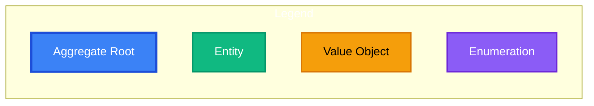
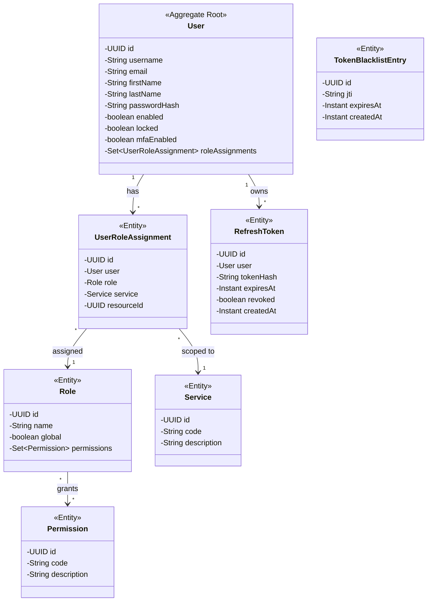
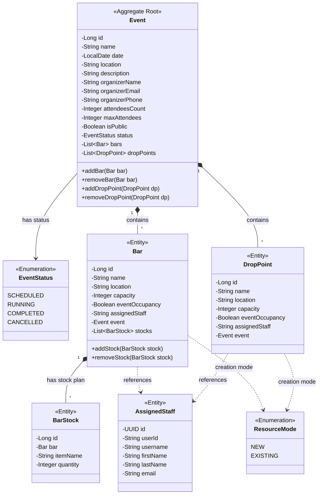
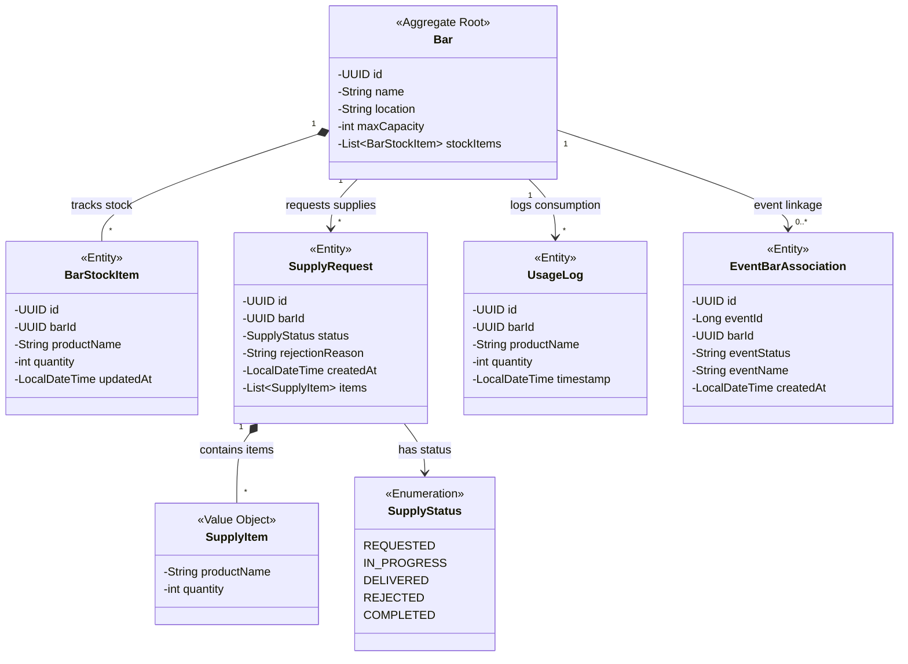
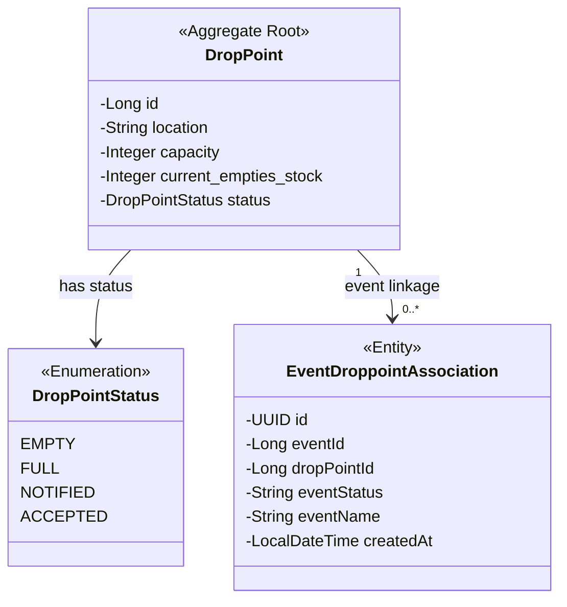
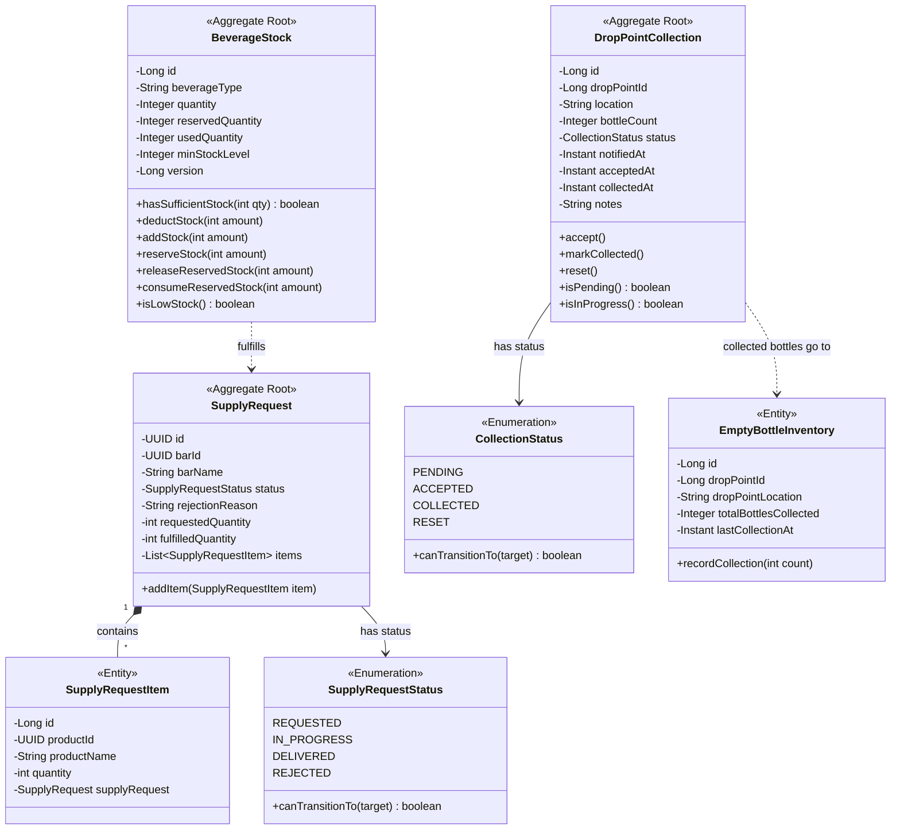
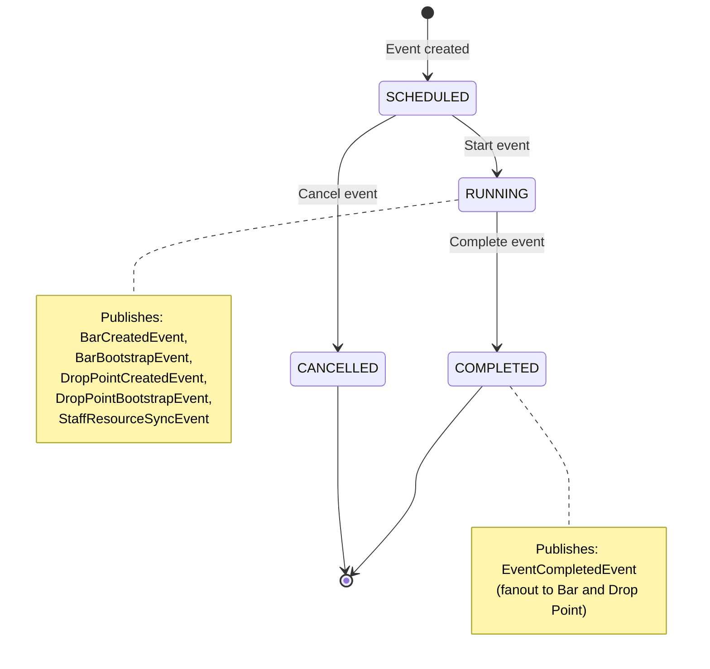
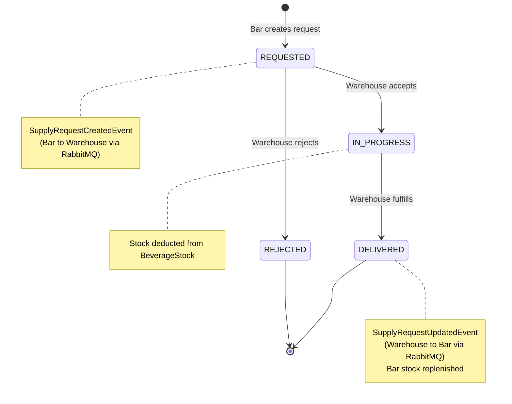
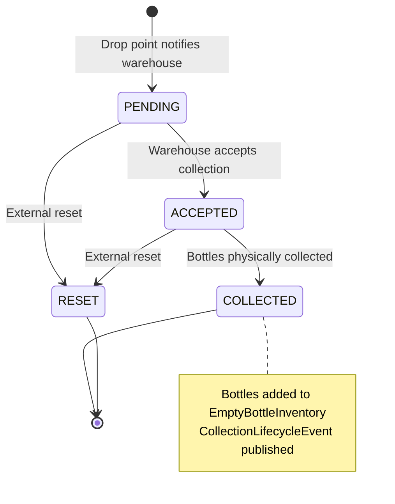
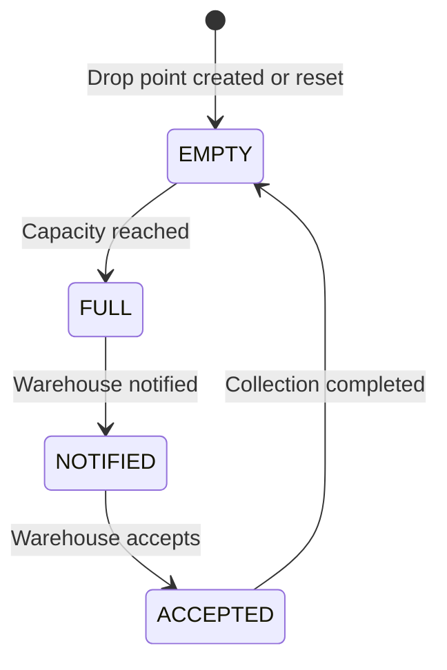

# NextBar — DDD Tactical Design

This document presents the **Tactical Design** patterns used within each Bounded Context, answering **"How"** the domain logic is implemented. It covers aggregate design, entity classification, value objects, domain services, repositories, domain events, and state machines.

---

## Table of Contents

- [Aggregate Design Overview](#aggregate-design-overview)
- [Tactical Patterns per Context](#tactical-patterns-per-context)
  - [Identity & Access Context](#identity--access-context)
  - [Event Planning Context](#event-planning-context)
  - [Bar Operations Context](#bar-operations-context)
  - [Drop Point Context](#drop-point-context)
  - [Warehouse Context](#warehouse-context)
- [State Machine Specifications](#state-machine-specifications)
- [Domain Events Catalog](#domain-events-catalog)
- [Anti-Corruption Layers](#anti-corruption-layers)
- [Aggregate Design Justifications](#aggregate-design-justifications)

---

## Aggregate Design Overview

An **Aggregate** is a cluster of domain objects treated as a single transactional unit. The **Aggregate Root** is the only entry point for external references.



| Context | Aggregate Root(s) | Entities | Value Objects | Enumerations |
|---------|-------------------|----------|---------------|--------------|
| Identity & Access | `User` | `Role`, `Permission`, `Service`, `UserRoleAssignment`, `RefreshToken`, `TokenBlacklistEntry` | — | — |
| Event Planning | `Event` | `Bar`, `BarStock`, `DropPoint`, `AssignedStaff` | — | `EventStatus`, `ResourceMode` |
| Bar Operations | `Bar` | `BarStockItem`, `SupplyRequest`, `UsageLog`, `EventBarAssociation` | `SupplyItem` | `SupplyStatus` |
| Drop Point | `DropPoint` | `EventDroppointAssociation` | — | `DropPointStatus` |
| Warehouse | `BeverageStock`, `SupplyRequest`, `DropPointCollection` | `SupplyRequestItem`, `EmptyBottleInventory` | — | `SupplyRequestStatus`, `CollectionStatus` |

---

## Tactical Patterns per Context

### Identity & Access Context



**Domain Services:**
- `UserService` — User CRUD, profile management, password hashing
- `RbacService` — Role-based access evaluation from JWT claims
- `TokenLifecycleService` — Token creation, refresh, revocation, and blacklisting
- `LoginAttemptService` — Brute-force protection with exponential back-off

**Repositories:**
- `UserRepository`, `RoleRepository`, `PermissionRepository`, `ServiceRepository`
- `UserRoleAssignmentRepository`, `RefreshTokenRepository`, `TokenBlacklistRepository`

---

### Event Planning Context



**Domain Services:**
- `EventService` — Event lifecycle management (SCHEDULED → RUNNING → COMPLETED)
- `BarService` — Bar configuration within event planning
- `BarStockService` — Stock plan definition for event bars
- `DropPointService` — Drop point configuration within event planning

**External Service Clients (Anti-Corruption Layer):**
- `UserServiceClient` — Feign client to Identity & Access (with `UserServiceClientFallback`)
- `WarehouseServiceClient` — Feign client to Warehouse (with `WarehouseServiceClientFallback`)

**Repositories:**
- `EventRepository`, `BarRepository`, `BarStockRepository`, `DropPointRepository`, `AssignedStaffRepository`

---

### Bar Operations Context



**Key Design Note:** `SupplyItem` is implemented as an **@Embeddable** (Value Object), not a standalone entity. It has no identity of its own and is always accessed through the `SupplyRequest` aggregate.

**Domain Services:**
- `BarService` — Bar CRUD and event bootstrapping
- `BarStockService` — Stock operations (add, reduce, serve drink)
- `SupplyRequestService` — Supply request creation, cancellation, status updates
- `UsageLogService` — Immutable drink serving records and analytics

**Event Publishers / Listeners:**
- `SupplyEventPublisher` — Publishes `supply.request.created`
- `EventPlannerBarEventListener` — Consumes `event.bar.created`, `event.bar.bootstrap`
- `SupplyEventListener` — Consumes `supply.request.updated` from warehouse

**Repositories:**
- `BarRepository`, `BarStockItemRepository`, `SupplyRequestRepository`, `UsageLogRepository`, `EventBarAssociationRepository`

---

### Drop Point Context



**Domain Services:**
- `DropPointService` — Core operations: receive bottles, check capacity, reset, warehouse coordination

**Event Publishers / Listeners:**
- `DropPointCollectionEventPublisher` — Publishes when capacity reached
- `DropPointBootstrapConsumer` — Consumes bootstrap from Event Planner
- `DropPointCreatedConsumer` — Consumes creation events
- `EventCompletedConsumer` — Handles event completion cleanup
- `WarehouseCollectionStatusConsumer` — Processes warehouse collection confirmations

**Repositories:**
- `DropPointRepository`, `EventDroppointAssociationRepository`

---

### Warehouse Context

The most domain-rich context, featuring multiple aggregate roots, rich business methods, optimistic locking, and two independent state machines.



**Key Design Notes:**
- `BeverageStock` uses **@Version** for optimistic locking, preventing lost updates under concurrent stock modifications.
- Both `SupplyRequestStatus` and `CollectionStatus` implement `canTransitionTo()` methods, enforcing valid state transitions at the domain level rather than relying on application services.
- `DropPointCollection` encapsulates business methods (`accept()`, `markCollected()`, `reset()`) that enforce invariants internally.

**Domain Services:**
- `StockService` — Beverage stock CRUD, reservation, low-stock detection
- `SupplyRequestProcessingService` — End-to-end supply request fulfillment workflow
- `EmptyBottleCollectionService` — Collection task management and inventory aggregation

**Event Publishers / Listeners:**
- `SupplyEventPublisher` — Publishes `supply.request.updated`
- `SupplyEventListener` — Consumes `supply.request.created` from bars
- `DropPointCollectionEventListener` — Consumes collection notifications from drop points
- `WarehouseCollectionLifecyclePublisher` — Publishes collection status back to drop points

**Repositories:**
- `BeverageStockRepository`, `SupplyRequestRepository`, `DropPointCollectionRepository`, `EmptyBottleInventoryRepository`

---

## State Machine Specifications

### Event Lifecycle



### Supply Request Lifecycle (Bar to Warehouse)

This state machine spans two bounded contexts. The supply request originates in the Bar context, is mirrored in the Warehouse context, and status updates flow back.



### Drop Point Collection Lifecycle



### Drop Point Status Lifecycle



---

## Domain Events Catalog

Complete catalog of all domain events in the system, organized by publishing context.

### Published by Event Planning Context

| Event | Exchange | Type | Payload | Consumers |
|-------|----------|------|---------|-----------|
| `BarCreatedEvent` | `event.bar.created` | topic | barId, name, location, eventId | Bar Service |
| `BarBootstrapEvent` | `event.bar.bootstrap` | topic | barId, name, location, stocks[], eventId, eventName | Bar Service |
| `DropPointCreatedEvent` | `event.droppoint.created` | topic | dropPointId, name, location, eventId | Drop Points |
| `DropPointBootstrapEvent` | `event.drop-point.bootstrap` | topic | dropPointId, name, location, capacity, eventId | Drop Points |
| `EventCompletedEvent` | `event.completed` | fanout | eventId, eventName, status | Bar, Drop Points |
| `StaffResourceSyncEvent` | `event.staff.resource.sync` | topic | userId, role, serviceCode, resourceId | Users Service |
| `EventStartedEvent` | `event.started` | fanout | eventId, status | (planned) |
| `StaffAssignedEvent` | `event.staff.assigned` | topic | userId, resourceId, role | (planned) |
| `StockReservedConsumedEvent` | `stock.reserved.consumed` | topic | eventId, items[] | (planned) |

### Published by Bar Operations Context

| Event | Exchange | Type | Payload | Consumers |
|-------|----------|------|---------|-----------|
| `SupplyRequestCreatedEvent` | `supply.request.created` | topic | requestId, barId, barName, items[] | Warehouse |

### Published by Warehouse Context

| Event | Exchange | Type | Payload | Consumers |
|-------|----------|------|---------|-----------|
| `SupplyRequestUpdatedEvent` | `supply.request.updated` | topic | requestId, barId, status, items[] | Bar Service |
| `WarehouseCollectionLifecycleEvent` | `drop-point.collection.lifecycle` | topic | dropPointId, status, bottleCount | Drop Points |

### Published by Drop Point Context

| Event | Exchange | Type | Payload | Consumers |
|-------|----------|------|---------|-----------|
| `DropPointCollectionStatusEvent` | `drop-point.collection.events` | topic | dropPointId, location, bottleCount | Warehouse |

### WebSocket Broadcast

| Event | Exchange | Type | Relay |
|-------|----------|------|-------|
| UI update events | `nextbar.events` | fanout | Gateway RabbitListener → WebSocket `/ws/events` |

---

## Anti-Corruption Layers

Anti-Corruption Layers (ACLs) prevent upstream domain concepts from leaking into downstream contexts. In NextBar, ACLs are implemented through **event listeners that translate external events into local domain operations**.

### Warehouse → Bar (Supply Request Updates)

The Warehouse context publishes `SupplyRequestUpdatedEvent` with `SupplyRequestStatus` (an enum defined in `com.nextbar.warehouse.model.enums`). The Bar Service's `SupplyEventListener` receives this event and translates the status into its own local `SupplyStatus` enum (defined in `com.nextbar.bar.model`).

```
Warehouse publishes:  SupplyRequestStatus.DELIVERED
                           ↓ (RabbitMQ)
Bar ACL translates:   SupplyStatus.DELIVERED
Bar domain action:    BarStockService.addStock(items)
```

### Warehouse → Drop Point (Collection Lifecycle)

The Warehouse context publishes `WarehouseCollectionLifecycleEvent` with `CollectionStatus`. The Drop Point Service's `WarehouseCollectionStatusConsumer` translates this into the local `DropPointStatus` state machine.

```
Warehouse publishes:  CollectionStatus.COLLECTED
                           ↓ (RabbitMQ)
DropPoint ACL:        DropPointStatus → EMPTY (reset stock to 0)
```

### Event Planner → Bar / Drop Point (Bootstrap)

The Event Planner publishes `BarBootstrapEvent` and `DropPointBootstrapEvent` containing planning-phase models. The downstream consumers translate these into their own local domain objects (`Bar`, `BarStockItem`, `DropPoint`) that have different structures and semantics from the planning models.

---

## Aggregate Design Justifications

### Why does `Event` own `Bar` and `DropPoint` in the Event Planning Context?

During the planning phase, a Bar or Drop Point has no independent operational lifecycle. It exists solely as configuration data attached to an upcoming Event. Destroying the Event implies destroying its planned resources (cascade delete). However, once the event starts, those configurations are **projected** via domain events into the Bar and Drop Point contexts where they become independent Aggregate Roots with their own identities and lifecycles.

### Why is `SupplyRequest` an Aggregate Root in the Warehouse Context?

A `SupplyRequest` has its own distinct lifecycle (REQUESTED → IN_PROGRESS → DELIVERED), often handled by different staff members over hours. If it were part of the `BeverageStock` aggregate, a warehouse worker fulfilling an order would constantly hit concurrency lock conflicts (`@Version` optimistic locking) with other workers managing different inventory items. By separating them, `SupplyRequest` tracks the workflow independently, while `BeverageStock` strictly protects the integer count of bottles with optimistic locking.

### Why is `BeverageStock` a separate Aggregate Root (not part of a "Warehouse" aggregate)?

There is no single "Warehouse" entity in the domain model. The warehouse is a **logical concept** represented by the entire bounded context. `BeverageStock` is typed per beverage (`beverageType` with unique constraint), and each stock record can be independently modified. This fine-grained aggregate boundary minimizes lock contention: updating the stock of "Beer" does not lock "Water".

### Why doesn't the Bar Context hold master User information?

The Bar Context only needs a user identifier (UUID) and a display name for assigned staff. Treating Identity as a separate Bounded Context protects the Bar domain from being polluted with password hashes, email verification, MFA flags, or RBAC logic. Staff information is synchronized via `StaffResourceSyncEvent` domain events.
